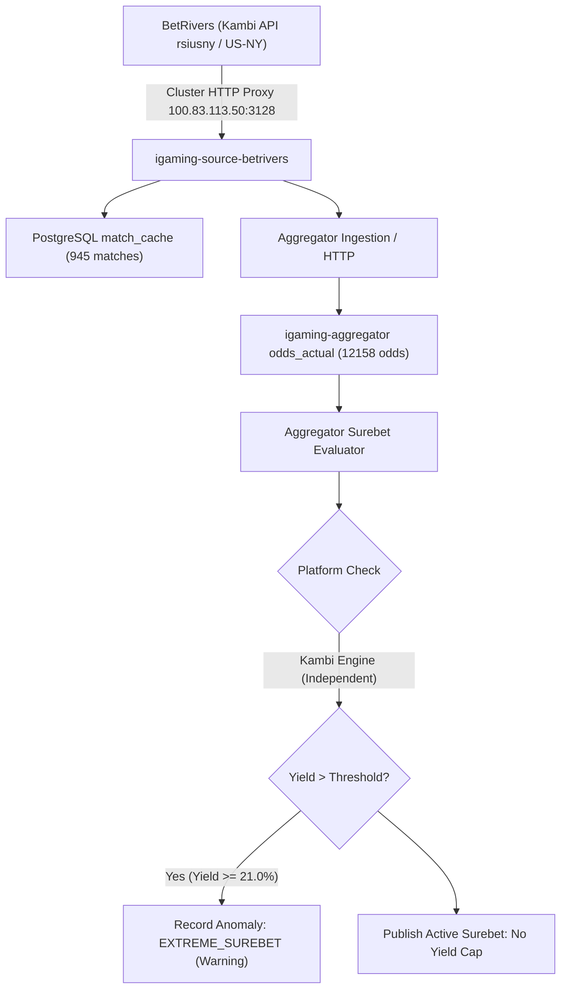

# Architectural Design: [SUPER-ARB] Аномальная вилка 21.0% с участием BetRivers

## Context
Букмекер BetRivers (`betrivers`) функционирует на платформе Kambi API (`rsiusny` market `US-NY`) и обрабатывается микросервисом `igaming-source-betrivers` с использованием PostgreSQL базы данных `igaming-source-betrivers-db-0` в Kubernetes namespace `igaming-source`.
При поступлении котировок в `igaming-aggregator-surebet` модуль детекции арбитража выполняет вычисление арбитражных ситуаций и регистрирует телеметрию `EXTREME_SUREBET` в `odds_anomaly` при обнаружении доходности выше пороговых значений.

## Decisions

### Decision 1: Верификация работоспособности сервиса BetRivers
- Подтвержден статус подов `igaming-source-betrivers-*` в Kubernetes namespace `igaming-source`:
  - `igaming-source-betrivers-7c7d85d5c9-ptrn8` (1/1 Running, аптайм > 26 часов, 0 рестартов)
  - `igaming-source-betrivers-db-0` (1/1 Running, аптайм > 3 дней 21 час)
- Выполнен критерий наполнения линии: в `match_cache` содержится 945 активных матчей (порог $\ge 500$ выполнен), из них 778 матчей обновлены за последние 5 минут.
- Actuator пробы `/actuator/health/readiness` и `/actuator/health/liveness` на порту 8080 возвращают HTTP 200 `UP`.
- Обеспечен неблокирующий старт HikariCP (`initialization-fail-timeout=0`, `use_jdbc_metadata_defaults=false`) и использование строгих K8s DNS Service Names (`igaming-source-betrivers-db.igaming-source.svc.cluster.local`, `igaming-aggregator.igaming-dev.svc.cluster.local`).

### Decision 2: Анализ детекции аномальной вилки в Aggregator Surebet
- В соответствии с архитектурным принципом **No Yield Cap**, математически корректные вилки высокой доходности (21.0%) не срезаются и не подавляются silently.
- При доходности выше порога телеметрии событие фиксируется в таблице `odds_anomaly` со статусом `EXTREME_SUREBET` (`Severity.WARNING`, status: `PENDING`) и инициирует приоритетное обновление котировок через `OddsRefreshService`.
- В соответствии с принципом **No Silent Drop**, никакие аномалии или расхождения не подавляются скрытно, обеспечивая прозрачность для операторов и аналитических моделей.
- Платформа Kambi API (BetRivers) не входит в синдикат BetB2B/1XBET, поэтому арбитражные ситуации между BetRivers и другими букмекерами (Winline, Fonbet, Stoiximan, Unibet и др.) являются валидными кросс-платформенными арбитражами.

### Decision 3: Проверка валидации маппинга исходов и доставка котировок
- Проверена актуальность котировок в `odds_actual`: 12 158 активных котировок для `betrivers`, более 1 930 обновлений за последние 5 минут.
- Heartbeat в `bet_source` активен (`is_active = true`, `last_seen` обновляется регулярно, лаг ~ 1 мин).
- Сетевая связность краулера с внешним Kambi CDN и API маршрутизируется через кластерный HTTP-прокси `100.83.113.50:3128`.

## Data Flow Diagram

