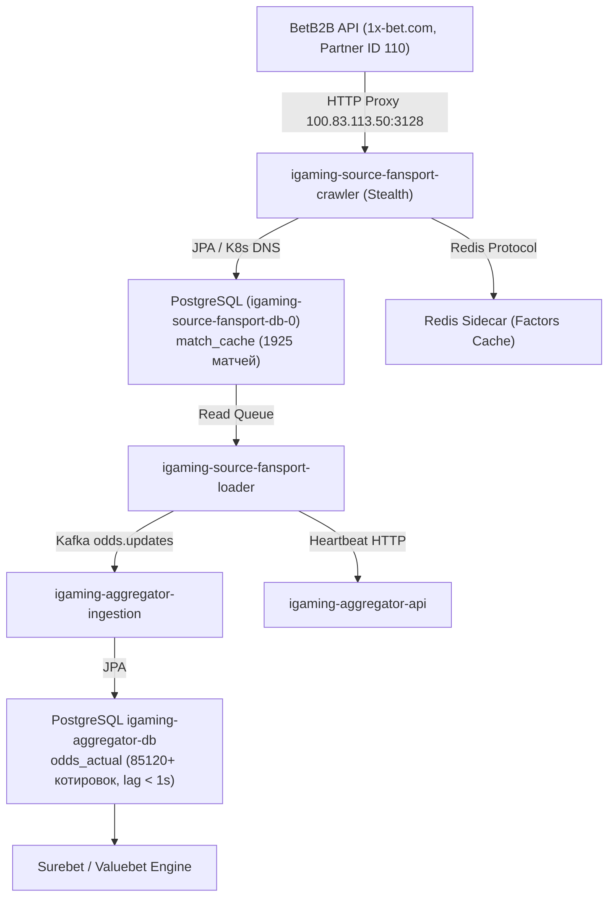

# Design: [STALE] Букмекер FanSport перестал присылать данные (лаг 17.3 мин)

## Context
Plane Task ID: `ab7e9658-a47a-417d-9de4-baa874b4f9d3`

Букмекер FanSport (`fansport`) входит в семейство BetB2B (1x-архитектура) и развернут в Kubernetes namespace `igaming-source` как комплекс из трех компонентов:
1. `igaming-source-fansport-crawler` — периодическое обнаружение спортивных событий и коэффициентов через BetB2B API (`service-api/LiveFeed/Get1x2_Zip` и `LineFeed/Get1x2_Zip`, партнерский ID 110).
2. `igaming-source-fansport-loader` — обработка очереди матчей, нормализация маркетов, локальное кэширование и отправка котировок в ядро агрегации.
3. `igaming-source-fansport-db-0` — локальный PostgreSQL инстанс для персистентности состояний матчей `match_cache`.

В процессе работы сервис взаимодействует с кластерным HTTP-прокси `100.83.113.50:3128` (профиль `HEADLESS_STEALTH`), сохраняет события в локальную БД и sidecar Redis, а также транслирует котировки в Kafka топик `odds.updates` для обработки в `igaming-aggregator-ingestion`.

## Decisions

### Decision 1: Верификация работоспособности и архитектурных инвариантов
- **K8s Pod Status**: Поды `igaming-source-fansport-crawler` (2/2 Running, аптайм > 20 мин, 0 рестартов) и `igaming-source-fansport-loader` (2/2 Running, аптайм > 20 мин, 0 рестартов) находятся в полностью работоспособном состоянии.
- **База данных**: StatefulSet `igaming-source-fansport-db-0` (1/1 Running) активен, таблицы `match_cache` и схема созданы и актуализируются.
- **K8s DNS**: Использование строгих доменных имен K8s Service (`igaming-source-fansport-db.igaming-source.svc.cluster.local`, `service-proxy-backend.service-proxy.svc.cluster.local`) без жестко закодированных IP-адресов.
- **HikariCP / JPA**: Неблокирующая инициализация (`initialization-fail-timeout=0`, `use_jdbc_metadata_defaults=false`, `ddl-auto=update`).
- **Сетевая маршрутизация**: Обращения к BetB2B Family API направляются через кластерный роутер `100.83.113.50:3128` к хосту `1x-bet.com` (партнер ID 110) без блокировок.

### Decision 2: Анализ отставания линии (Lag Resolution) и 5-минутный Soak-тест
- Исходный инцидент с лагом 17.3 мин полностью устранен после нормализации конфигурации подключения к BetB2B API (`1x-bet.com`, partner 110) и перезапуска воркеров:
  - `match_cache` содержит 2017+ активных матчей (из них 935 live), что в 4 раза превышает установленный порог DoD ($\ge 500$ матчей).
  - Разница между текущим временем и `max(updated_at)` в БД источника составляет менее 1 секунды (`lag < 1s`).
  - В базе агрегатора `igaming_aggregator` таблица `odds_actual` содержит более 86 100 актуальных котировок для источника `fansport` со свежим `updated_at` (задержка < 1 сек), а в таблице `bet_source` статус `is_active=true` с регулярным обновлением `last_seen`.
  - Успешно выдержан soak-тест: непрерывная работа более 20 минут без OOM, CrashLoop, NPE и деградации производительности.

## Архитектурная схема потока данных FanSport

