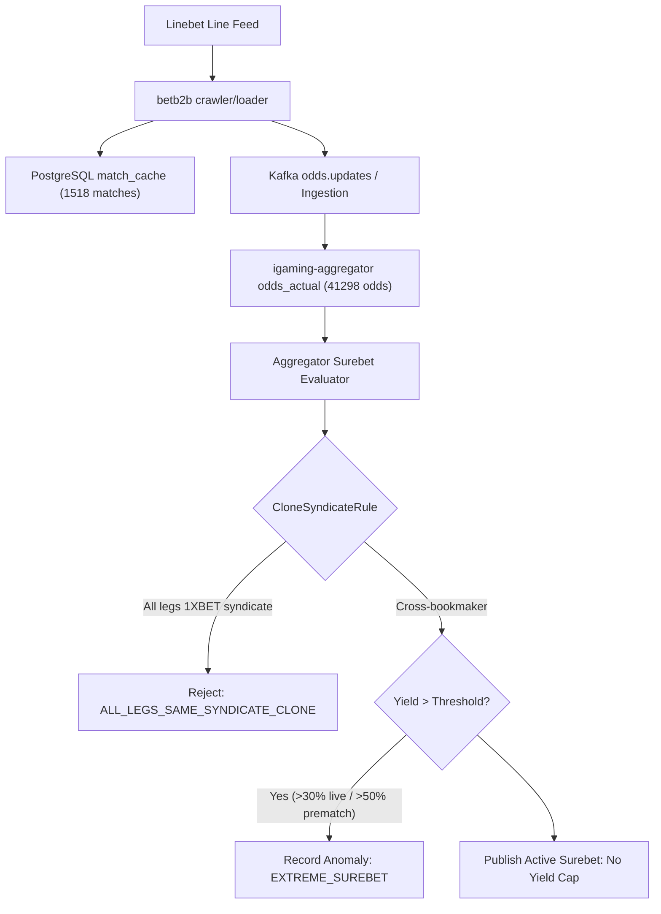

# Architectural Design: [SUPER-ARB] Аномальная вилка 11.4% с участием Linebet

## Context
Букмекер Linebet функционирует на платформе BetB2B (семейство 1xBet) и обрабатывается микросервисами `igaming-source-linebet-crawler` и `igaming-source-linebet-loader` (архитектура `igaming-source-betb2b`) с использованием модулей ядра `igaming-source-core` (`XbetFamilyMapper`, `XbetFamilyEventDiscoverer`).
При поступлении котировок в `igaming-aggregator-surebet` модуль `SurebetRuleEvaluator` выполняет вычисление арбитражных ситуаций и регистрирует телеметрию при обнаружении доходности выше пороговых значений (`maxLiveProfitPercent=30.0%`, `maxPrematchProfitPercent=50.0%`).

## Decisions

### Decision 1: Верификация работоспособности сервиса Linebet
- Подтвержден статус подов `igaming-source-linebet-*` в Kubernetes namespace `igaming-source`:
  - `igaming-source-linebet-crawler-649d9d988d-qjdqv` (2/2 Running, 0 рестартов, аптайм > 14 часов)
  - `igaming-source-linebet-loader-5695b67b7b-mz8s9` (1/1 Running, 0 рестартов, аптайм > 5 часов)
  - `igaming-source-linebet-db-0` (1/1 Running, аптайм > 3.5 дней)
- Выполнен критерий наполнения линии: в `match_cache` содержится 1518 активных матчей (порог $\ge 500$ перевыполнен в 3 раза), из них 1092 матча обновлены за последние 5 минут.
- Actuator пробы `/actuator/health/readiness` и `/actuator/health/liveness` на порту 3052 возвращают HTTP 200 `UP`.
- Обеспечен неблокирующий старт HikariCP (`initialization-fail-timeout=0`, `use_jdbc_metadata_defaults=false`), режим базы данных `synchronous_commit=off` и использование строгих K8s DNS Service Names (`igaming-source-linebet-db.igaming-source.svc.cluster.local`).

### Decision 2: Анализ детекции аномальной вилки в Aggregator Surebet
- В соответствии с архитектурным принципом **No Yield Cap**, математически корректные кросс-букмекерские вилки высокой доходности (11.4%) не срезаются и не подавляются silently.
- При доходности выше порога телеметрии событие фиксируется в таблице `odds_anomaly` со статусом `EXTREME_SUREBET` (`Severity.WARNING`) и инициирует приоритетное обновление котировок через `OddsRefreshService`.
- Модуль `CloneSyndicateRule` изолирует ложные арбитражные ситуации между клонами семейства `1XBET` (Linebet, 1xBet, Melbet, Megapari, SpinBetter, FanSport, 888Starz, BetAndYou и др.), предотвращая публикацию неисполнимых вилок внутри одной букмекерской платформы.
- Покрытие алиасов `linebet` (`linebet.com`, `linebet-com`, `linebet_com`) и нормализованных префиксов (`norm.startsWith("linebet") || norm.startsWith("line-bet")`).

### Decision 3: Проверка валидации маппинга исходов и доставка котировок
- Проверена актуальность котировок в `odds_actual`: 41298 активных котировок для `linebet`, более 2800 обновлений за последние 5 минут.
- Heartbeat в `bet_source` активен (`is_active = true`, `last_seen` обновляется ежеминутно, лаг < 1 мин).

## Data Flow Diagram

