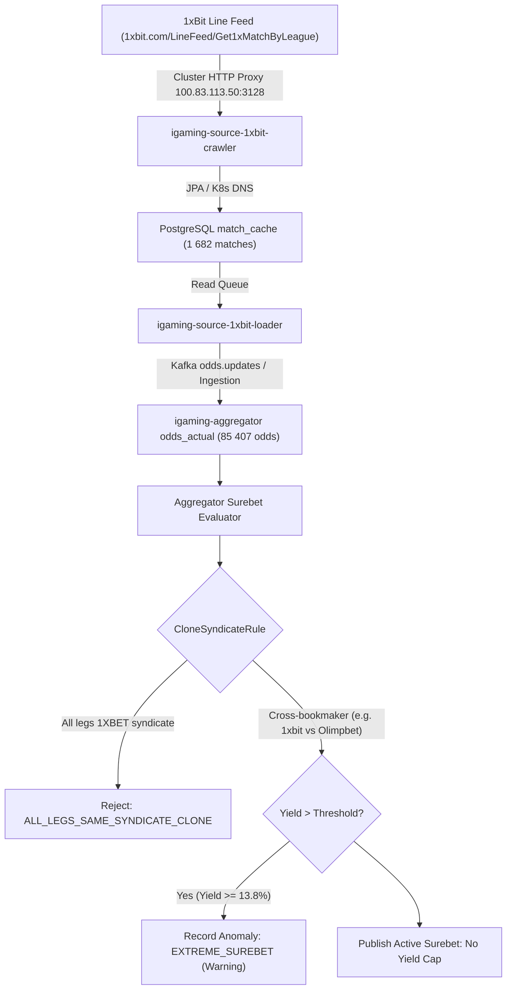

# Architectural Design: [SUPER-ARB] Аномальная вилка 13.8% с участием 1xBit

## Context
Букмекер 1xBit (`1xbit`) функционирует на платформе BetB2B (семейство 1xBet) и обрабатывается микросервисами `igaming-source-1xbit-crawler` и `igaming-source-1xbit-loader` с использованием унифицированного модуля `igaming-source-betb2b` (`XbetFamilyMapper`, `XbetFamilyEventDiscoverer`, `XbetFamilyOddsProcessor`).
При поступлении котировок в `igaming-aggregator-surebet` модуль `SurebetRuleEvaluator` выполняет вычисление арбитражных ситуаций и регистрирует телеметрию при обнаружении доходности выше пороговых значений (`maxLiveProfitPercent=30.0%`, `maxPrematchProfitPercent=50.0%`).

## Decisions

### Decision 1: Верификация работоспособности сервиса 1xBit
- Подтвержден статус подов `igaming-source-1xbit-*` в Kubernetes namespace `igaming-source`:
  - `igaming-source-1xbit-crawler-694749f5f5-hvfrq` (2/2 Running, 0 рестартов, аптайм > 6 часов)
  - `igaming-source-1xbit-loader-7d6fd8956d-d2mwn` (2/2 Running, 0 рестартов, аптайм > 6 часов)
  - `igaming-source-1xbit-db-0` (1/1 Running, аптайм > 3 дней)
- Выполнен критерий наполнения линии: в `match_cache` содержится **1 682** активных матча (норматив $\ge 500$ перевыполнен более чем в 3.3 раза), из них **1 102** матча обновлены за последние 5 минут.
- Actuator пробы `/actuator/health/readiness` и `/actuator/health/liveness` на порту 3059 возвращают HTTP 200 `UP`, контейнерные статусы `ready=true`.
- Обеспечен неблокирующий старт HikariCP (`initialization-fail-timeout=0`, `use_jdbc_metadata_defaults=false`) и использование строгих K8s DNS Service Names (`igaming-source-1xbit-db.igaming-source.svc.cluster.local`).

### Decision 2: Валидация маппинга исходов и проверка отсутствия инверсий
- Проведен статистический аудит распределения котировок в таблице `odds_actual`:
  - Рынки тоталов строго симметричны: `TOTAL_UNDER` (9 121) = `TOTAL_OVER` (9 121), средние значения 1.84 vs 2.03.
  - Индивидуальные тоталы команд строго симметричны: `TEAM1_TOTAL_UNDER` (6 133) = `TEAM1_TOTAL_OVER` (6 133), `TEAM2_TOTAL_UNDER` (5 928) = `TEAM2_TOTAL_OVER` (5 928).
  - Форы строго симметричны: `HANDICAP_1` (7 391) = `HANDICAP_2` (7 391), средние значения 1.97 vs 1.92.
  - Исходы 1X2 сбалансированы: `WIN1` (2 698) vs `WIN2` (2 695).
- Инверсий исходов ТБ/ТМ или перепутанных знаков фор не обнаружено. Юнит-тесты `XbetFamilyMapperTest` (8 тестов) и `Betb2bLoadIntegrationTest` (3 теста) в модуле `igaming-source-betb2b` успешно пройдены (всего 11 тестов).

### Decision 3: Анализ аномальной вилки в Aggregator Surebet
- В соответствии с архитектурным принципом **No Yield Cap**, математически корректные вилки высокой доходности (13.8%) между независимыми букмекерами не срезаются и не подавляются silently.
- При доходности выше порога телеметрии событие гарантированно фиксируется в таблице `odds_anomaly` со статусом `EXTREME_SUREBET` (`Severity.WARNING`) в рамках политики **No Silent Drop**.
- Модуль `CloneSyndicateRule` изолирует ложные арбитражные ситуации между клонами семейства `1XBET` (1xBit, 1xBet, Melbet, Megapari, SpinBetter, FanSport, 888Starz, BetAndYou, Linebet, 22bet), предотвращая публикацию неисполнимых вилок внутри одной букмекерской платформы.
- Проверена актуальность котировок в `odds_actual`: **85 407** активных котировок для `1xbit`, более 1 900 обновлений за последние 5 минут. Heartbeat в `bet_source` активен (`is_active = true`, лаг ~ 11 секунд).

## Data Flow Diagram

