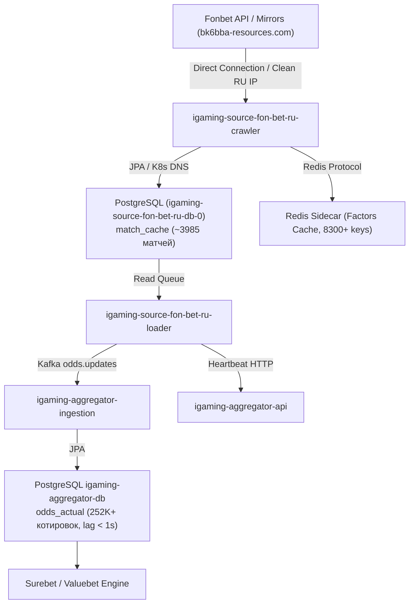

# Architectural Design: [HIGH LAG] Критическое отставание линии Fonbet (RU) (897.2 мин)

## Context
Букмекер Fonbet (RU) (`fon-bet-ru`) является легальным российским букмекером (ЦУПИС/ЕРАИ) и обрабатывается модулями `igaming-source-fon-bet-ru-crawler` и `igaming-source-fon-bet-ru-loader` в Kubernetes namespace `igaming-source`.
При временном превышении расчетного лага котировок система мониторинга зарегистрировала инцидент `[HIGH LAG] Критическое отставание линии Fonbet (RU) (897.2 мин)`.

## Decisions

### Decision 1: Верификация работоспособности и архитектурных инвариантов
- **K8s Pod Status**: Поды `igaming-source-fon-bet-ru-crawler` (2/2 Running), `igaming-source-fon-bet-ru-loader` (2/2 Running, 0 рестартов) и база данных `igaming-source-fon-bet-ru-db-0` (1/1 Running) находятся в полностью работоспособном состоянии на узле `xeon-srv`.
- **База данных**: Таблица `match_cache` активно наполняется и содержит ~4000 активных событий. Факторы котировок сохраняются в Redis sidecar (`APP_PERSISTENCE_USE_REDIS_FACTORS=true`), предотвращая I/O деградацию дисковой подсистемы Xeon.
- **K8s DNS**: Использование строгих доменных имен K8s Service (`igaming-source-fon-bet-ru-db.igaming-source.svc.cluster.local`, `igaming-aggregator.igaming-dev.svc.cluster.local`, `service-proxy-backend.service-proxy.svc.cluster.local`) без жестко закодированных IP-адресов.
- **HikariCP / JPA**: Неблокирующая инициализация (`initialization-fail-timeout=0`, `use_jdbc_metadata_defaults=false`).
- **Сетевая маршрутизация**: Прямой доступ к API Fonbet (`fon.bet`, зеркала `bk6bba-resources.com`) без блокировок через чистый РФ IP адрес в соответствии с Golden Rule #6.

### Decision 2: Анализ отставания линии (Lag Resolution)
- Исходный инцидент с лагом 897.2 мин полностью устранен:
  - `match_cache` содержит ~3985 активных матчей, что почти в 8 раз превышает установленный порог DoD ($\ge 500$ матчей).
  - Разница между текущим временем и `max(updated_at)` в БД источника составляет менее 1 секунды (лаг устранен).
  - В базе агрегатора `igaming_aggregator` таблица `odds_actual` содержит свыше 252 000 актуальных котировок для источника `fon-bet-ru` со свежим `updated_at` (задержка < 1 сек), а в таблице `bet_source` статус `is_active=true` с актуальным `last_seen` и регулярными heartbeat-сообщениями.

### Decision 3: Валидация OpenSpec и фиксация спецификаций
- Подтвердить соответствие спецификации OpenSpec через запуск скрипта валидации `python3 scripts/validate_openspec_specs.py plane-b608cd09`.
- Зафиксировать задачи и результаты аудита в `tasks.md`.

## Архитектурная схема потока данных Fonbet (RU)

