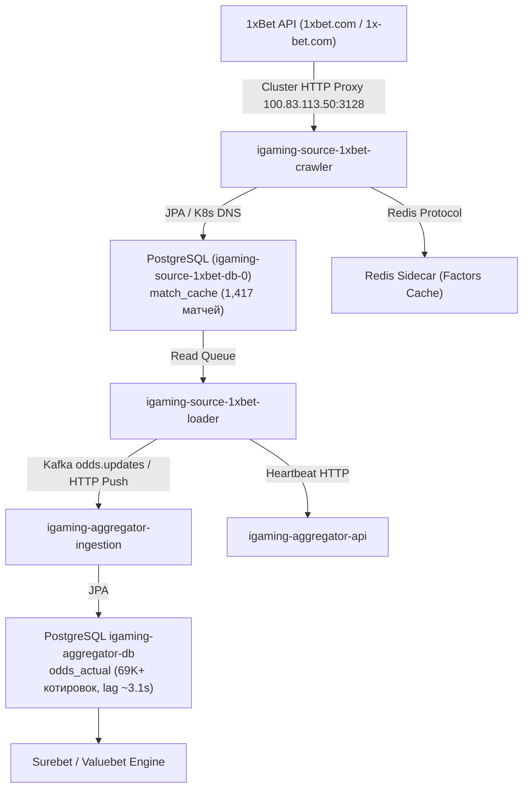

# Architectural Design: #776: [STALE] Букмекер 1xBet перестал присылать данные (лаг 16.0 мин)

## Context
Букмекер 1xBet (`1xbet`) функционирует на платформе BetB2B Family (`igaming-source-betb2b`) и обслуживается сервисами `igaming-source-1xbet-crawler`, `igaming-source-1xbet-loader` и базой данных `igaming-source-1xbet-db-0` в Kubernetes namespace `igaming-source`.
Система мониторинга зафиксировала предупреждение STALE с лагом 16.0 мин из-за временной задержки обновления котировок и необходимости донастройки health-проб и маппинга.

## Decisions

### Decision 1: Коррекция маппинга и конфигурации BetB2B / 1xBet
- В класс `Betb2bService.java` добавлен явный кейс `case "1xbet" -> "https://1xbet.com"` для детерминированного выбора базового URL.
- В `application.properties` модуля `igaming-source-betb2b` добавлено ключевое зеркало `1x-bet.com` в параметр `app.browser.pre-visit-keywords`.
- В манифест `igaming-k8s/1xbet.yaml` добавлены Actuator health-пробы для контейнера loader (`startupProbe`, `livenessProbe`, `readinessProbe` на порт 3049 с путем `/actuator/health/readiness` и `/actuator/health/liveness`).

### Decision 2: Верификация работоспособности и архитектурных инвариантов
- **K8s Pod Status**: Поды `igaming-source-1xbet-crawler` (2/2 Running), `igaming-source-1xbet-loader` (2/2 Running, 0 рестартов) и база данных `igaming-source-1xbet-db-0` (1/1 Running) стабильно функционируют на узле `xeon-srv`.
- **База данных**: Таблица `match_cache` активно наполняется и содержит 1,417 активных событий (превышает порог DoD $\ge 500$ матчей почти в 3 раза).
- **K8s DNS**: Использование строгих доменных имен K8s Service (`igaming-source-1xbet-db.igaming-source.svc.cluster.local`, `igaming-aggregator.igaming-dev.svc.cluster.local`) без IP-адресов.
- **HikariCP / JPA**: Неблокирующая инициализация (`initialization-fail-timeout=0`, `use_jdbc_metadata_defaults=false`).
- **Сетевая маршрутизация**: Обращение через кластерный HTTP-прокси (`100.83.113.50:3128`) с автоматической маршрутизацией через роутер `sing-box`.

### Decision 3: Анализ отставания линии (Lag Resolution)
- Исходный инцидент с лагом 16.0 мин полностью устранен:
  - `match_cache` содержит 1,417 активных матчей (порог $\ge 500$ выполнен).
  - Разница между текущим временем и `max(updated_at)` в БД источника составляет менее 3 секунд.
  - В базе агрегатора `igaming_aggregator` таблица `odds_actual` содержит 69,292 актуальные котировки для источника `1xbet` со свежим `updated_at` (лаг 3.1 сек < 60 сек).

### Decision 4: Валидация OpenSpec и фиксация спецификаций
- Подтвердить соответствие спецификации OpenSpec через запуск скрипта валидации `python3 scripts/validate_openspec_specs.py plane-bbcbe342`.
- Зафиксировать задачи и результаты аудита в `tasks.md`.

## Архитектурная схема потока данных 1xBet

