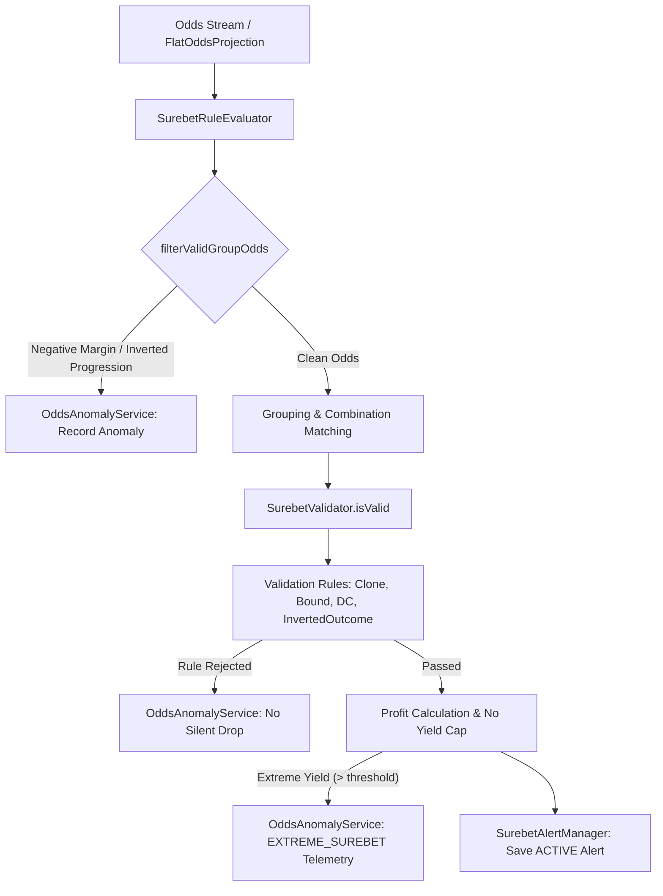

# Architectural Design: #45: [aggregator] Детекция структурных аномалий и валидация инвертированных исходов (No Silent Drop & No Yield Cap)

## Context
В модуле `aggregator-surebet` реализованы конвейеры поиска арбитражных ситуаций (Surebets), коридоров (Middles) и перевеса (+EV Value Bets).
Для обеспечения высочайшего качества данных и предотвращения публикации некорректных ставок функционирует слой валидации `SurebetValidator`.

### Ключевые проблемы:
1. **Silent Drop (Скрытый сброс)**: Ранее при отклонении связки исходов правилами валидации (`DoubleChanceDominanceRule`, `ComplementaryMarketBoundRule`, `CloneSyndicateRule`) производился лишь вывод `log.info()`. Событие не сохранялось в базе аномалий `odds_anomaly`, что лишало инженеров и ML-модели возможности автоматически выявлять сбои мапперов конкретных букмекеров.
2. **Инвертированные исходы (Inverted Outcomes)**: В 3-way исходах (1X2) при рассинхронизации парсеров (когда букмекер B путает порядок хозяев и гостей) возникают ложные вилки с гигантской доходностью, где оба плеча являются исходами на андердога с высокими коэффициентами. Существующее правило `ComplementaryMarketBoundRule` проверяет только 2-way исходы.
3. **Нарушение монотонности прогрессий (Monotonicity Inversions)**: Внутри одного букмекера ошибки фида могут давать инвертированные коэффициенты на тоталы (Over 2.5 > Over 1.5) или форы.

---

## Decisions

### Decision 1: Телеметрический аудит валидатора (No Silent Drop)
- **Решение**: Внедрить `OddsAnomalyService` в `SurebetValidator`. При отклонении кандидата любым из зарегистрированных правил `SurebetValidationRule`:
  - Логируется предупреждение.
  - Формируется объект `OddsAnomalyDto` с указанием участвующих букмекеров, вида спорта, ID матча, описания ошибки, типа аномалии (`rule.getRejectionReason()`) и уровня критичности (`Severity.ERROR`).
  - Аномалия асинхронно персистится через `OddsAnomalyService.recordAnomaly()`.
- **Обоснование**: Полное соблюдение правила No Silent Drop — ни один отброшенный исход не исчезает бесследно.

### Decision 2: Выделенное правило детекции инвертированных исходов (`InvertedOutcomeRule`)
- **Решение**: Реализовать компонент `InvertedOutcomeRule implements SurebetValidationRule`:
  - **3-Way 1X2 инверсия**: Если в 3-way связке `WIN1`, `DRAW`, `WIN2` оба коэффициента на победу $K(WIN1) > 3.0$ и $K(WIN2) > 3.0$ при $K(DRAW) > 2.80$, либо оба $K(WIN1) > 3.20$ и $K(WIN2) > 3.20$ — связка бракуется как структурно невозможная инверсия (перепутанные команды Home/Away).
  - Причина отказа: `INVERTED_OUTCOME_DOMINANCE_VIOLATION`.
- **Обоснование**: В спортивном матче обе команды не могут одновременно являться глубокими андердогами при высоком коэффициенте на ничью.

### Decision 3: Детекция внутренних аномалий фида в `SurebetRuleEvaluator`
- **Решение**: В методе `filterValidGroupOdds`:
  - При выявлении отрицательной маржи одного букмекера ($invSum < 0.99$) фиксировать аномалию `NEGATIVE_MARGIN` (`Severity.CRITICAL`).
  - Проверять монотонность коэффициентов тоталов одного букмекера (если $Over(T_2) < Over(T_1) - 0.20$ при $T_2 > T_1$) с фиксацией `INVERTED_TOTAL_PROGRESSION` (`Severity.ERROR`).
- **Обоснование**: Очищает пул котировок до этапа комбинаторного матчинга и передает диагностические данные для авторемонта краулера.

### Decision 4: Бескомпромиссная политика No Yield Cap
- **Решение**: Легитимные вилки с любой математически обоснованной доходностью (15%, 35%, 60%+) незамедлительно сохраняются и вещаются со статусом `Status.ACTIVE`.
- Превышение порогов `maxLiveProfitPercent` / `maxPrematchProfitPercent` служит триггером фоновой телеметрии `EXTREME_SUREBET` (`Severity.WARNING`) и запроса приоритетного обновления коэффициентов (`OddsRefreshService`), но не блокирует отображение вилки пользователям.

---

## Архитектурная схема взаимодействия

