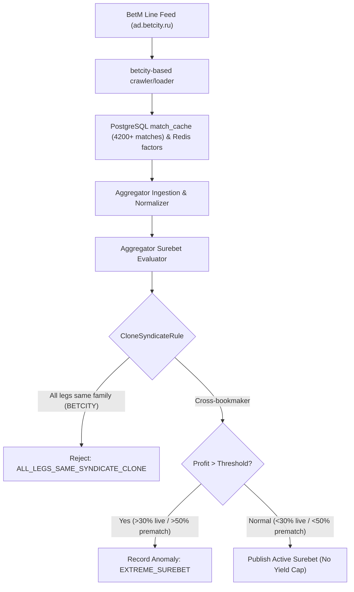

# Architectural Design: [SUPER-ARB] Аномальная вилка 29.2% с участием BetM

## Context
Букмекер BetM функционирует на платформе Betcity и развёрнут в кластере Kubernetes в namespace `igaming-source` модулями `igaming-source-betm-crawler` и `igaming-source-betm-loader` с использованием базовых компонентов платформы Betcity (`APP_TARGET_HOST=ad.betcity.ru`, `APP_BOOKMAKER_NAME=betm`).
При поступлении котировок в `igaming-aggregator-surebet` модуль `SurebetRuleEvaluator` производит поиск арбитражных ситуаций и регистрирует телеметрию в случае обнаружения доходности выше пороговых значений (`maxLiveProfitPercent=30.0%`, `maxPrematchProfitPercent=50.0%`).

## Decisions

### Decision 1: Верификация работоспособности сервиса BetM
- Подтвердить статус подов `igaming-source-betm-*` в Kubernetes namespace `igaming-source` (`Running 2/2` и `Running 1/1`).
- Гарантировать выполнение критерия наполнения линии (Threshold $\ge 500$ матчей в `match_cache`, текущее значение 4233 матча).
- Обеспечить неблокирующий старт HikariCP, персистентность факторов в Redis (4600+ записей) и использование K8s DNS Service Names (`igaming-source-betm-db`).

### Decision 2: Анализ детекции аномальной вилки в Aggregator Surebet
- В соответствии с архитектурным принципом **No Yield Cap**, математически корректные вилки с высокой доходностью (29.2%) не должны искусственно занижаться или отбрасываться без фиксации.
- При доходности, превышающей порог телеметрии (>30.0% лайв, >50.0% прематч), арбитражная ситуация фиксируется в таблице `odds_anomaly` со статусом `EXTREME_SUREBET` (`Severity.WARNING`) и инициирует приоритетное обновление котировок через `OddsRefreshService`.
- Вилки с доходностью 29.2% лежат в пределах допустимого рабочего диапазона прематча (<50.0%) и публикуются в активные сигналы без отсечения.
- Правило `CloneSyndicateRule` корректно изолирует арбитражи внутри одного синдиката (`BETCITY` family: Betcity, Betcity.com, BetM), предотвращая ложные арбитражи между клонами одной платформы.

### Decision 3: Проверка валидации маппинга исходов
- Проверить отсутствие конфликтов и несмапленных исходов в `unmapped_bet` и `mapping_conflict`.
- Убедиться в корректности знаков и монотонности тоталов и фор.

## Архитектурная схема валидации вилок

