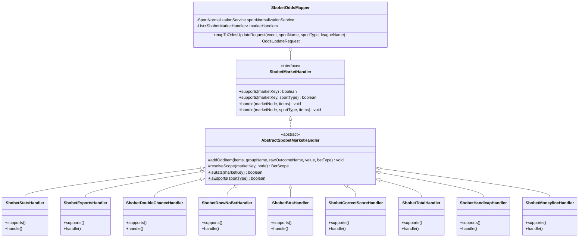

# Architecture Design: [sbobet] ООП-рефакторинг мапперов: Киберспорт, Статистика (Угловые/ЖК) и роспись исходов

## Architecture & Class Diagram

## Order of Handlers Execution
1. `@Order(10) SbobetStatsHandler`: Угловые (Corners), Карточки (Yellow Cards/Cards).
2. `@Order(20) SbobetEsportsHandler`: Карты (Maps), Раунды (Rounds), Киллы (Kills), First Blood для киберспорта.
3. `@Order(30) SbobetDoubleChanceHandler`: 1X, 12, X2 (Match and Half-1).
4. `@Order(40) SbobetDrawNoBetHandler`: Ничья исключена (WIN1_2WAY, WIN2_2WAY).
5. `@Order(50) SbobetBttsHandler`: Обе забьют (YES/NO).
6. `@Order(60) SbobetCorrectScoreHandler`: Точный счет и Any Other Score.
7. `@Order(70) SbobetTotalHandler`: Тоталы матча и таймов.
8. `@Order(80) SbobetHandicapHandler`: Форы и спреды матча и таймов.
9. `@Order(90) SbobetMoneylineHandler`: 1X2 и Moneyline матча и таймов.
