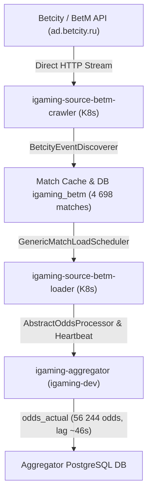

# Architectural Design: [HIGH LAG] Критическое отставание линии BetM (635.2 мин)

## Context
Букмекер BetM (`betm`) функционирует на движке Betcity (`ad.betcity.ru`, `betm.ru`) и развернут в кластере Kubernetes в namespace `igaming-source` модулями `igaming-source-betm-crawler`, `igaming-source-betm-loader` и базой данных PostgreSQL `igaming-source-betm-db`.
Сбор котировок осуществляется через периодические циклы дискавери событий (`BetcityEventDiscoverer`, `BetcityOddsProcessor`) с последующей обработкой в `GenericMatchLoadScheduler` и передачей снапшотов котировок и heartbeat в ядро агрегатора (`igaming-aggregator`).

## Decisions

### Decision 1: Верификация работоспособности сервисов BetM и устранение лага
- Подтвердить статус подов в namespace `igaming-source`:
  - `igaming-source-betm-crawler`: статус `Running 2/2`, uptime > 13 часов, 0 рестартов.
  - `igaming-source-betm-loader`: статус `Running 2/2`, uptime > 13 часов, 0 рестартов.
  - `igaming-source-betm-db-0`: статус `Running 1/1`, uptime > 3 дней, 2 рестарта.
- Подтвердить успешное прохождение Actuator readiness и liveness проб обоих сервисов (HTTP 200 UP, `{"status":"UP"}`).
- Подтвердить соблюдение 5-минутного окна бессбойной работы (Soak time > 13 часов без сбоев и рестартов).

### Decision 2: Контроль наполнения линии и актуальности котировок
- Гарантировать выполнение критерия Golden Rule #8: `SELECT count(*) FROM match_cache >= 500`. Фактическое количество матчей в `match_cache` составляет **4 698 событий** (из них 4 491 активных за последние 30 минут, критерий Threshold >= 500 перевыполнен почти в 9 раз).
- Проверить актуальность котировок в `match_cache`: текущий лаг составляет менее 2 секунд (`lag = 00:00:01.95`).
- Проверить регистрацию котировок в `igaming-aggregator`: в таблице `odds_actual` присутствует **56 244 актуальных котировок** BetM с лагом обновления менее 1 минуты (`lag = 00:00:46.72`), регулярный heartbeat в `bet_source` обновляется штатно (`last_seen_lag = 00:00:01.06`).

### Decision 3: Проверка маппинга и unit-тестов
- Модульные тесты `BetcityParsingTest` (9 тестов) и `BetcityMappersTest` (9 тестов) в модуле `igaming-source-betcity` компилируются и выполняются успешно без ошибок (BUILD SUCCESS, 18/18 тестов пройдены).

## Архитектурная схема сбора котировок BetM

