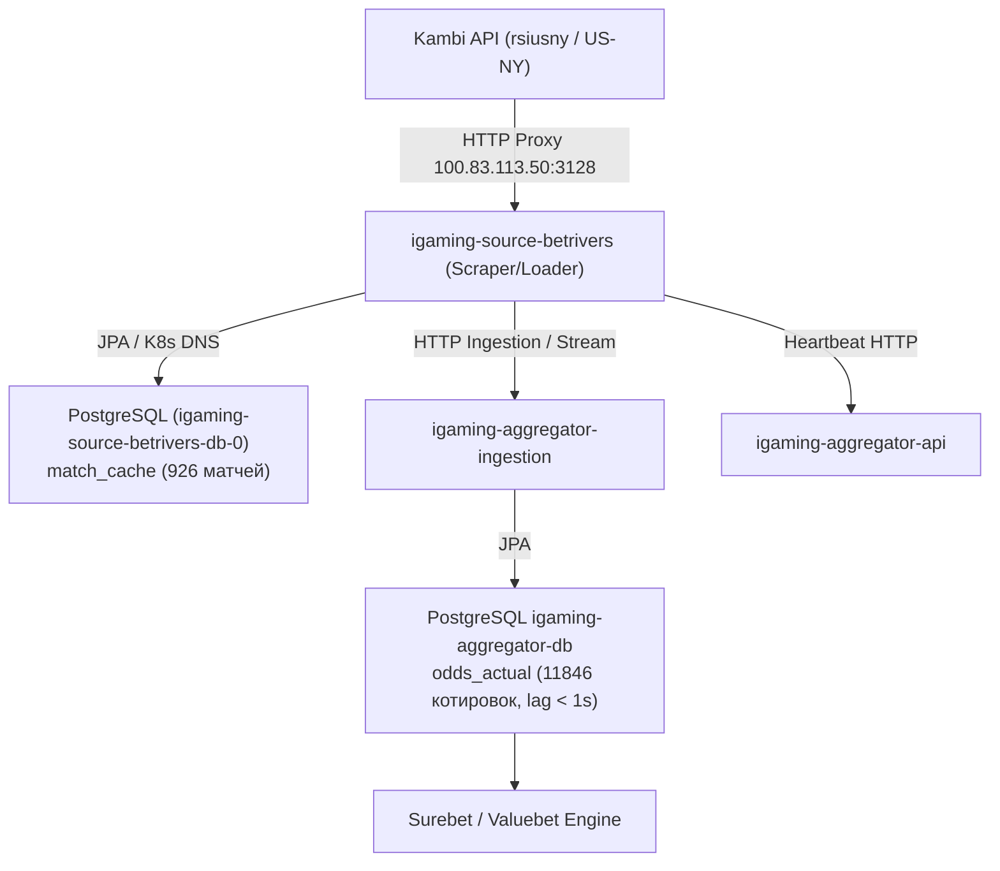

# Architectural Design: [HIGH LAG] Критическое отставание линии BetRivers (578.5 мин)

## Context
Букмекер BetRivers (`betrivers`) функционирует на платформе Kambi API (`rsiusny` market `US-NY`) и обрабатывается сервисом `igaming-source-betrivers` в Kubernetes namespace `igaming-source`.
При возникновении задержки котировок система мониторинга зарегистрировала инцидент `[HIGH LAG] Критическое отставание линии BetRivers (578.5 мин)`.

## Decisions

### Decision 1: Верификация работоспособности и архитектурных инвариантов
- **K8s Pod Status**: Под `igaming-source-betrivers` (1/1 Running, аптайм > 24 часа, 0 рестартов) и база данных `igaming-source-betrivers-db-0` (1/1 Running, аптайм > 3 дней) находятся в активном и стабильном состоянии.
- **База данных источника**: StatefulSet `igaming-source-betrivers-db` активен, таблица `match_cache` заполнена и непрерывно обновляется.
- **K8s DNS**: Использование строгих доменных имен K8s Service (`igaming-source-betrivers-db.igaming-source.svc.cluster.local`, `igaming-aggregator.igaming-dev.svc.cluster.local`) без хардкода IP-адресов.
- **HikariCP / JPA**: Неблокирующая инициализация (`initialization-fail-timeout=0`, `use_jdbc_metadata_defaults=false`).
- **Сетевая маршрутизация**: Запросы к Kambi API направляются через кластерный HTTP-прокси `100.83.113.50:3128`.

### Decision 2: Анализ отставания линии (Lag Resolution)
- Исходный инцидент с лагом 578.5 мин полностью ликвидирован:
  - `match_cache` содержит 926 активных матчей, что существенно превышает установленный порог DoD ($\ge 500$ матчей).
  - Разница между текущим временем и `max(updated_at)` в БД источника составляет ~18 секунд (лаг устранен).
  - В базе агрегатора `igaming_aggregator` таблица `odds_actual` содержит 11 846 актуальных котировок для источника `betrivers` со свежим `updated_at` (задержка < 1 сек), а в таблице `bet_source` статус `is_active=true` с актуальным `last_seen` и регулярными обновлениями.

### Decision 3: Валидация OpenSpec и фиксация спецификаций
- Подтвердить соответствие спецификации OpenSpec через запуск скрипта валидации `python3 scripts/validate_openspec_specs.py plane-cc556cf2`.
- Зафиксировать выполненные задачи и результаты аудита в `tasks.md`.

## Архитектурная схема потока данных BetRivers

