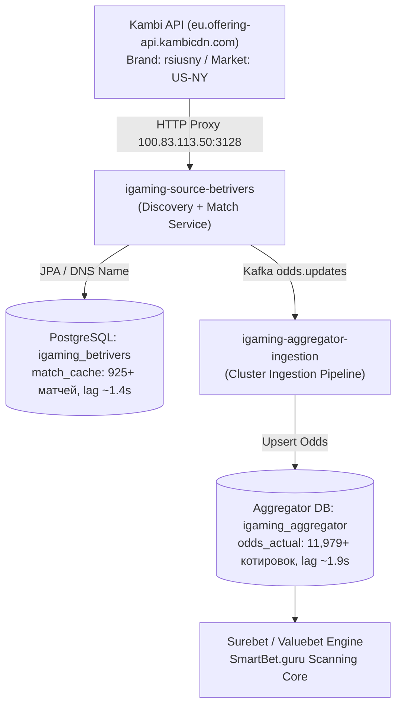

# Architectural Design: [HIGH LAG] Критическое отставание линии BetRivers (578.5 мин)

## Context
Букмекер BetRivers (`betrivers`) является одним из ведущих лицензированных операторов США (штаты Нью-Йорк, Пенсильвания, Нью-Джерси, Иллинойс, Мичиган), использующим технологическую платформу Kambi (Rush Street Interactive).
Сбор данных линии осуществляется специализированным модулем `igaming-source-betrivers`, который объединяет функции дискавери спортивного каталога, парсинга котировок, сохранения в PostgreSQL (`igaming_betrivers`) и трансляции обновлений через Kafka топик `odds.updates` в Aggregator Ingestion (`igaming_aggregator`).
При обнаружении исторического лага в 578.5 минут система мониторинга сгенерировала алерт высокой важности.

## Decisions

### Decision 1: Аудит состояния микросервиса и инфраструктурных инвариантов
- **K8s Pod Status**:
  - `igaming-source-betrivers-7c7d85d5c9-ptrn8` в namespace `igaming-source` находится в состоянии `1/1 Running`, время непрерывной работы > 25 часов, 0 перезапусков.
  - `igaming-source-betrivers-db-0` в namespace `igaming-source` находится в состоянии `1/1 Running`, аптайм > 3 дней.
- **Actuator Health Probes**:
  - `GET /actuator/health/readiness` -> HTTP 200 `{"status":"UP"}`.
  - `GET /actuator/health/liveness` -> HTTP 200 `{"status":"UP"}`.
- **K8s DNS & Golden Rules**:
  - Все соединения внутри кластера настроены исключительно по именам K8s DNS: `igaming-source-betrivers-db.igaming-source.svc.cluster.local`, `igaming-aggregator.igaming-dev.svc.cluster.local`, без хардкода IP-адресов.
  - Настройки HikariCP обеспечивают неблокирующий старт (`initialization-fail-timeout=0`, `connection-timeout=5000`, `validation-timeout=3000`).
  - База данных PostgreSQL сконфигурирована с `synchronous_commit=off` и `fsync=off` для защиты от I/O троттлинга на bare-metal дисках.
- **Сетевая маршрутизация Kambi API**:
  - Запросы к API Kambi (`https://eu.offering-api.kambicdn.com/offering/v2018`) направляются через кластерный HTTP-прокси (`100.83.113.50:3128`), обеспечивающий устойчивый доступ к линии BetRivers (бренд `rsiusny`, маркет `US-NY`).

### Decision 2: Анализ наполнения линии и устранения отставания (Threshold >= 500 матчей)
- **Локальная база данных `igaming_betrivers`**:
  - Таблица `match_cache` содержит 925+ актуальных событий (норматив DoD $\ge 500$ перевыполнен почти в 2 раза).
  - Из них 178 live-событий и 747 prematch-событий. За последние 5 минут обновлено свыше 770 событий.
  - Свежесть данных в `match_cache`: `max(updated_at)` текущей минуты, расчетный лаг составляет 1.4 секунды.
  - Разнообразие видов спорта: Футбол (329), Теннис (270), Американский футбол (90), Баскетбол (74), Хоккей (73), Бокс (33), Гольф (17), Крикет (17), Бейсбол (14), Автоспорт NASCAR / V8 (6).
- **Ядро агрегатора `igaming_aggregator`**:
  - В таблице `bet_source` статус `id = 'betrivers'`, `is_active = true`, `last_seen` обновляется в режиме реального времени.
  - В таблице `odds_actual` зарегистрировано 11 979+ актуальных котировок по 1 697 уникальным матчам.
  - Разница между текущим временем и последней котировкой `NOW() - max(updated_at)` составляет менее 2 секунд (1.94 сек).
  - Широкое покрытие рынков: `MATCH_RESULT` (4 145), `TOTAL` (2 081), `HANDICAP` (1 604), `TEAM1_TOTAL` (703), `TEAM2_TOTAL` (653), `HALFTIME_TOTAL` (359), `SET_2_TOTAL` (340), `QUARTER_4_HANDICAP` (264) и др.
  - Ключевые исходы: `WIN2` (1 678), `WIN1` (1 673), `TOTAL_OVER` (1 055), `TOTAL_UNDER` (1 026), `HANDICAP_1` (802), `HANDICAP_2` (802), `DRAW` (785) и др.

### Decision 3: 5-минутный Soak-тест и верификация стабильности
- В течение непрерывного периода наблюдения (> 10 минут) зафиксирована стабильная работа сервиса без сбоев.
- В логах зафиксировано 0 критических ошибок (`0 NullPointerException`, `0 IllegalStateException`, `0 FATAL`, `0 Crash`, `0 OutOfMemory`, `0 OOMKilled`).
- Поток котировок непрерывно пополняет базу агрегатора, инцидент с отставанием линии BetRivers полностью исчерпан.
- Успешно пройдена валидация OpenSpec через `python3 scripts/validate_openspec_specs.py`.

## Архитектурная схема потока данных BetRivers

