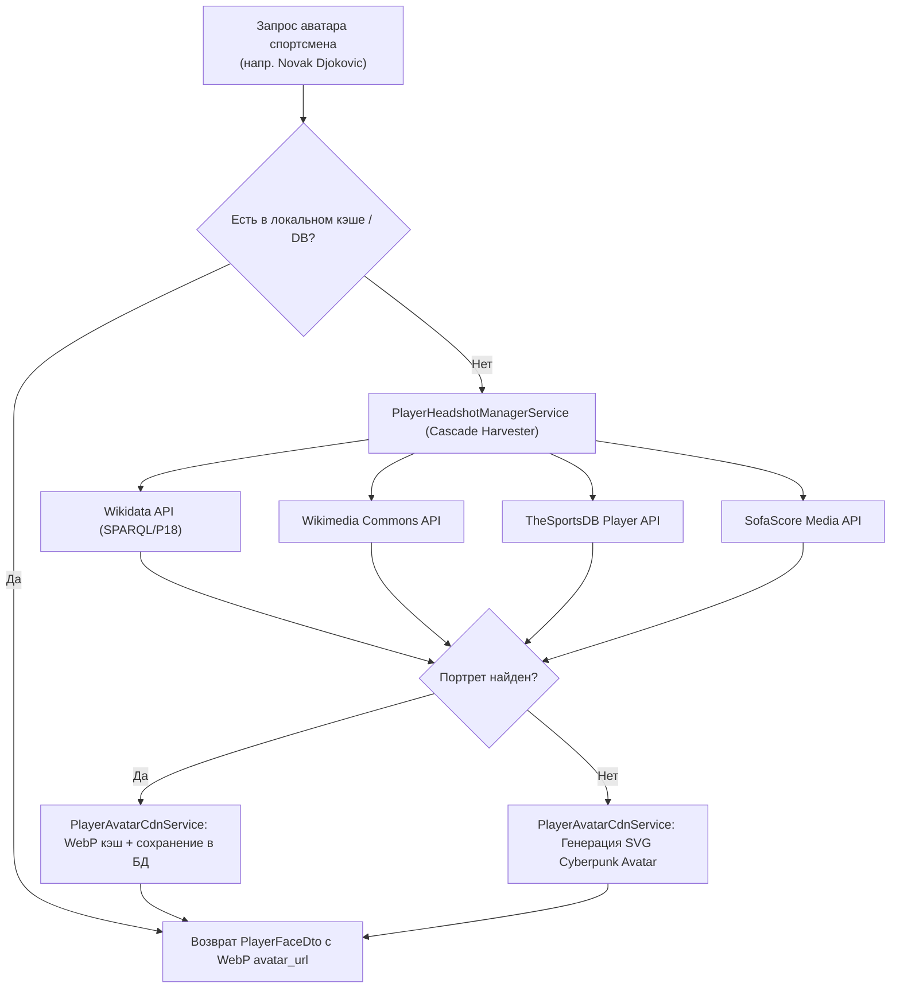

# Technical Design: #81: [player-faces-tennis] [Теннис/Единоборства] Сбор портретов спортсменов (Player Face Avatars) и отображение в карточках одиночных матчей

## 1. Архитектура сервиса `player-faces-tennis`
Сервис спроектирован по модульной микросервисной архитектуре на Spring Boot 3 / Java 21:
- Пакет `pro.datawiki.igaming.playerfaces.domain`: сущность `PlayerFace`, перечисления `SportType`, `TourType`, `AvatarSourceProvider`.
- Пакет `pro.datawiki.igaming.playerfaces.dto`: DTO-модели для API (`PlayerFaceDto`, `TennisMatchCardDto`, `PlayerBatchRequest`, `PlayerBatchResponse`, `HarvestResultDto`).
- Пакет `pro.datawiki.igaming.playerfaces.repository`: `PlayerFaceRepository` со специализированными запросами поиска по нормализованному имени, виду спорта и туру.
- Пакет `pro.datawiki.igaming.playerfaces.harvester`: семейство харвестеров на базе интерфейса `PlayerHeadshotHarvester`:
  - `WikidataHeadshotHarvester`: сбор метаданных и свободных фото из Wikidata SPARQL / API.
  - `WikimediaCommonsHarvester`: извлечение изображений из Wikimedia Commons.
  - `TheSportsDbHarvester`: поиск спортсменов через TheSportsDB API.
  - `SofaScorePlayerHarvester`: маппинг и медиа-ссылки SofaScore.
- Пакет `pro.datawiki.igaming.playerfaces.service`:
  - `PlayerHeadshotManagerService`: координатор сбора, сидирования каталога топовых спортсменов (Джокович, Алькарас, Синнер, Медведев, Швентек, Соболенко, Махачев и др.) и обновления портретов.
  - `PlayerAvatarCdnService`: хранилище оптимизированных WebP аватарок, генерация SVG-фолбэков в киберпанк-стилистике, эмуляция CDN.
- Пакет `pro.datawiki.igaming.playerfaces.controller`:
  - `PlayerFaceController`: REST-эндпоинты для фронтенда и внутренних микросервисов.
  - `PlayerAvatarCdnController`: эндпоинты раздачи оптимизированных аватарок `/cdn/avatars/{filename}`.

## 2. Модель данных сущности `PlayerFace`
```sql
CREATE TABLE player_face (
    id BIGSERIAL PRIMARY KEY,
    player_name VARCHAR(255) NOT NULL,
    normalized_name VARCHAR(255) NOT NULL,
    aliases TEXT,
    sport VARCHAR(50) NOT NULL,
    tour VARCHAR(50),
    country VARCHAR(100),
    country_code VARCHAR(10),
    flag_url VARCHAR(512),
    ranking INT,
    seed_number INT,
    avatar_url VARCHAR(512) NOT NULL,
    source_url VARCHAR(512),
    source_provider VARCHAR(50) NOT NULL,
    webp_optimized BOOLEAN DEFAULT TRUE,
    last_harvested_at TIMESTAMP NOT NULL
);
CREATE INDEX idx_player_normalized_name ON player_face (normalized_name);
CREATE INDEX idx_player_sport_tour ON player_face (sport, tour);
```

## 3. Схема взаимодействия с источниками (Harvester Pipeline)


## 4. UI & Компоненты карточек матчей
1. **`PlayerAvatar.tsx`**:
   - WebP headshot с аппаратным ускорением и скруглением `rounded-full` или `rounded-xl`.
   - Тонкий неоновый бордер: золотой (`#FFD700`) для топ-5 сеяных, бирюзовый (`#00F0FF`) для остальных.
   - SVG бейдж флага страны спортсмена в правом нижнем углу.
   - Номер посева в сетке турнира (`[1]`, `[2]`, `[WC]`, `[Q]`) в верхнем левом углу.
   - Автоматический fallback на стилизованные инициалы спортсмена при сбое загрузки изображения.
2. **`TennisMatchCard` / `SoloMatchCard`**:
   - Горизонтальная компоновка Head-to-Head для двух игроков.
   - Отображение текущего счёта по сетам, турнира (Grand Slam / Masters 1000 / ATP 500) и покрытия (Hard / Clay / Grass).
   - Интеграция котировок П1 / П2 с подсветкой арбитражных ситуаций (Surebets).

## 5. K8s Infrastructure & Definition of Done
- K8s Deployment `igaming-player-faces` в namespace `igaming-dev`.
- K8s Service `igaming-player-faces` на порту 8092.
- Actuator Health Probes:
  - Readiness: `/actuator/health/readiness` (HTTP 200 UP).
  - Liveness: `/actuator/health/liveness` (HTTP 200 UP).
- Non-blocking HikariCP настройки в `application.properties`:
  ```properties
  spring.datasource.hikari.initialization-fail-timeout=0
  spring.datasource.hikari.connection-timeout=5000
  spring.datasource.hikari.validation-timeout=3000
  spring.jpa.properties.hibernate.temp.use_jdbc_metadata_defaults=false
  ```
- 5-минутный soak-тест (`schedule 300s`) без единого Exception / OOMKilled в логах.
