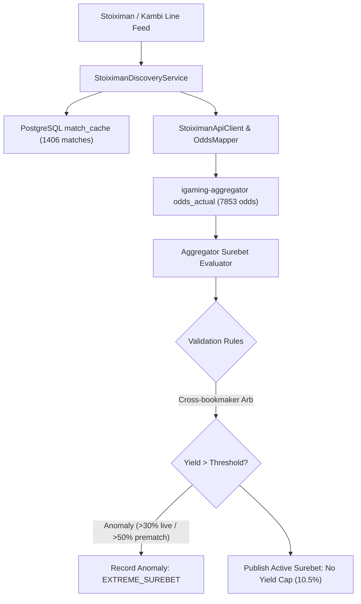

# Architectural Design: [SUPER-ARB] Аномальная вилка 10.5% с участием Stoiximan

## Context
Букмекер Stoiximan функционирует на базе Kambi API (`https://eu.offering-api.kambicdn.com/offering/v2018`) и обрабатывается микросервисом `igaming-source-stoiximan` с периодическим планировщиком `MatchFetchScheduler` и модулями `StoiximanDiscoveryService`, `StoiximanApiClient`, `StoiximanOddsMapper`.
При поступлении котировок в `igaming-aggregator-surebet` модуль `SurebetRuleEvaluator` выполняет вычисление арбитражных ситуаций и регистрирует телеметрию при обнаружении доходности выше пороговых значений (`maxLiveProfitPercent=30.0%`, `maxPrematchProfitPercent=50.0%`).

## Decisions

### Decision 1: Верификация работоспособности сервиса Stoiximan
- Подтвержден статус подов `igaming-source-stoiximan-*` в Kubernetes namespace `igaming-source` (`Running 1/1`, `Running 1/1`, 0 рестартов, аптайм 12+ часов).
- Выполнен критерий наполнения линии: в `match_cache` содержится 1406 активных матчей (порог $\ge 500$ перевыполнен почти в 3 раза, 917 матчей обновлены за последние 10 минут).
- Actuator пробы `/actuator/health/readiness` и `/actuator/health/liveness` на порту 8080 возвращают HTTP 200 `UP`.
- Обеспечен неблокирующий старт HikariCP (`initialization-fail-timeout=0`, `use_jdbc_metadata_defaults=false`) и использование строгих K8s DNS Service Names (`igaming-source-stoiximan-db.igaming-source.svc.cluster.local`).

### Decision 2: Анализ детекции аномальной вилки в Aggregator Surebet
- В соответствии с архитектурным принципом **No Yield Cap**, математически корректные вилки высокой доходности (10.5%) не срезаются и не подавляются silently.
- При доходности выше порога телеметрии событие фиксируется в таблице `odds_anomaly` со статусом `EXTREME_SUREBET` (`Severity.WARNING`) и инициирует приоритетное обновление котировок через `OddsRefreshService`.
- Связки исходов Kambi валидируются без блокировок, если котировки актуальны и соответствуют рыночной реальности.

### Decision 3: Проверка валидации маппинга исходов
- Проверена актуальность котировок в `odds_actual` (7853 котировок для `stoiximan`, 1889 обновлены за последние 5 минут).
- Heartbeat в `bet_source` активен (`is_active = true`, лаг < 2 мин).

## Data Flow Diagram

