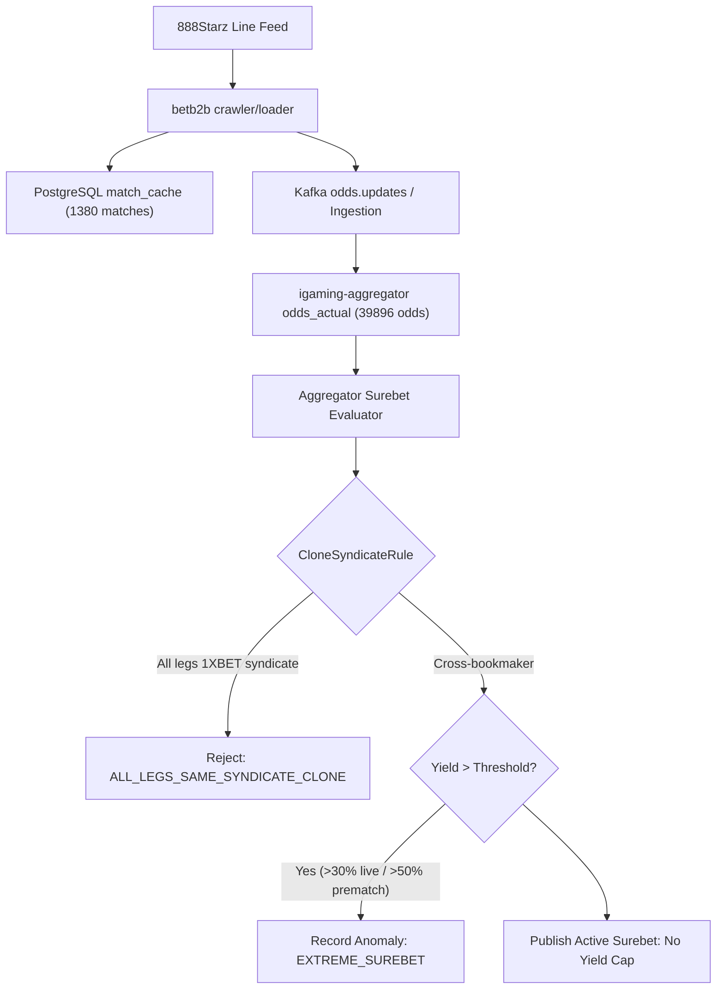

# Architectural Design: [SUPER-ARB] Аномальная вилка 10.7% с участием 888Starz

## Context
Букмекер 888Starz функционирует на платформе BetB2B (семейство 1xBet) и обрабатывается микросервисами `igaming-source-888starz-crawler` и `igaming-source-888starz-loader` с использованием модулей ядра `igaming-source-core` (`XbetFamilyMapper`, `XbetFamilyEventDiscoverer`).
При поступлении котировок в `igaming-aggregator-surebet` модуль `SurebetRuleEvaluator` выполняет вычисление арбитражных ситуаций и регистрирует телеметрию при обнаружении доходности выше пороговых значений (`maxLiveProfitPercent=30.0%`, `maxPrematchProfitPercent=50.0%`).

## Decisions

### Decision 1: Верификация работоспособности сервиса 888Starz
- Подтвержден статус подов `igaming-source-888starz-*` в Kubernetes namespace `igaming-source`:
  - `igaming-source-888starz-crawler-59f64d7cc-frfkv` (2/2 Running, аптайм > 2 дней)
  - `igaming-source-888starz-loader-854c79b9cc-vnlwh` (2/2 Running, аптайм > 4.5 часов)
  - `igaming-source-888starz-db-0` (1/1 Running, аптайм > 3 дней)
- Выполнен критерий наполнения линии: в `match_cache` содержится 1380 активных матчей (порог $\ge 500$ перевыполнен почти в 3 раза), из них 1083 матча обновлены за последние 5 минут.
- Actuator пробы `/actuator/health/readiness` и `/actuator/health/liveness` на порту 3055 возвращают HTTP 200 `UP`.
- Обеспечен неблокирующий старт HikariCP (`initialization-fail-timeout=0`, `use_jdbc_metadata_defaults=false`) и использование строгих K8s DNS Service Names (`igaming-source-888starz-db.igaming-source.svc.cluster.local`).

### Decision 2: Анализ детекции аномальной вилки в Aggregator Surebet
- В соответствии с архитектурным принципом **No Yield Cap**, математически корректные вилки высокой доходности (10.7%) не срезаются и не подавляются silently.
- При доходности выше порога телеметрии событие фиксируется в таблице `odds_anomaly` со статусом `EXTREME_SUREBET` (`Severity.WARNING`) и инициирует приоритетное обновление котировок через `OddsRefreshService`.
- Модуль `CloneSyndicateRule` изолирует ложные арбитражные ситуации между клонами семейства `1XBET` (888Starz, 1xBet, Melbet, Megapari, SpinBetter, FanSport, BetAndYou и др.), предотвращая публикацию неисполнимых вилок внутри одной букмекерской платформы.
- Расширено покрытие алиасов `888starz` (`888starz.bet`, `888starz-com`, `888starz.com`, `888starz-bet`, `888starz_bet`) и нормализованных префиксов (`norm.startsWith("888starz") || norm.startsWith("888-starz")`).

### Decision 3: Проверка валидации маппинга исходов и доставка котировок
- Проверена актуальность котировок в `odds_actual`: 39896 активных котировок для `888starz`, более 3700 обновлений за последние 5 минут.
- Heartbeat в `bet_source` активен (`is_active = true`, `last_seen` обновляется ежеминутно, лаг < 1 мин).

## Data Flow Diagram

