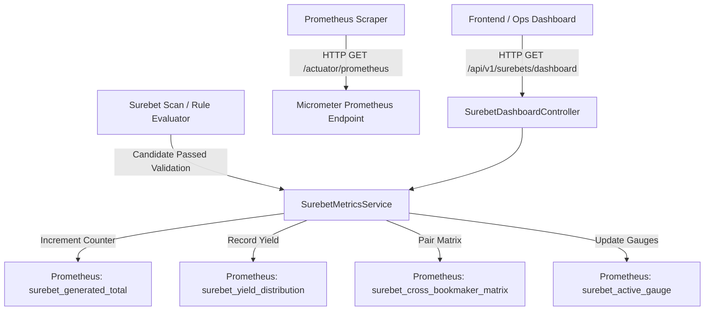

# Architectural Design: #46: [aggregator] Метрики и дашборд доходности вилок после расширения росписи маркетов

## Context
В модуле `aggregator-surebet` выполняется регулярное обнаружение межбукмекерского арбитража.
После масштабного расширения росписи маркетов (задачи #41, #44, #45: Чет/Нечет, BTTS, CS2 карты/раунды, статистика угловых и ЖК, детекция структурных аномалий) критически важно предоставить наблюдаемость (Observability) и аналитику доходности вилок в реальном времени.

### Требования к метрикам:
1. **Счетчик генерации вилок**: `surebet_generated_total{market_type="...", sport="..."}`.
2. **Количество активных вилок**: `surebet_active_gauge{market_type="..."}`.
3. **Гистограмма доходности**: `surebet_yield_distribution` с процентами профита (0-1%, 1-3%, 3-5%, 5-10%, 10%+).
4. **Матрица пар букмекеров (арбитражная связка)**: `surebet_cross_bookmaker_matrix{bookmaker_a="...", bookmaker_b="...", market_type="..."}`.
5. **Prometheus Actuator эндпоинт**: `/actuator/prometheus` на порту 8080.
6. **Внутренний REST дашборд**: `/api/v1/surebets/dashboard`.

---

## Decisions

### Decision 1: Включение Spring Boot Web и Micrometer Prometheus в aggregator-surebet
- **Решение**: Добавить `spring-boot-starter-web` и `micrometer-registry-prometheus` в `pom.xml`.
- В `application.properties` изменить `spring.main.web-application-type` на `servlet` (или убрать `none`), настроить `management.endpoints.web.exposure.include=health,info,metrics,prometheus`.
- **Обоснование**: Позволяет стандартным Prometheus серверам скрейпить метрики по `/actuator/prometheus`, а также поднимает встроенный REST API для операторского дашборда.

### Decision 2: Архитектура `SurebetMetricsService`
- **Решение**: Создать компонент `SurebetMetricsService`, инжектирующий `MeterRegistry`.
- Сервис инкапсулирует:
  - Регистрацию и инкремент счетчиков `surebet_generated_total` по видам спорта и типам маркетов (`MATCH_RESULT`, `TOTAL`, `HANDICAP`, `ODD_EVEN`, `BOTH_TEAMS_TO_SCORE`, `STATISTICS_CORNERS`, `STATISTICS_CARDS`, `ESPORTS_CS2`, `OTHER`).
  - Регистрацию `DistributionSummary` `surebet_yield_distribution` с `serviceLevelObjectives` [1.0, 3.0, 5.0, 10.0, 20.0, 50.0].
  - Регистрацию пар букмекеров `surebet_cross_bookmaker_matrix` (алфавитно упорядоченные пары $bm_1 \le bm_2$ для предотвращения дублирования направления пары).
  - Управление `AtomicInteger` для `surebet_active_gauge` по типам рынков.
  - Ведение внутренней in-memory статистики распределения для быстрого формирования JSON-ответа дашборда.

### Decision 3: Внутренний REST API дашборда доходности
- **Решение**: Реализовать `SurebetDashboardController` с маппингом `@RequestMapping("/api/v1/surebets")`:
  - `GET /api/v1/surebets/dashboard` — возвращает сводную аналитику: общее количество вилок, разбивку по диапазонам доходности (<1%, 1-3%, 3-5%, 5-10%, >10%), топ пар букмекеров, разбивку по типам маркетов и подтверждение прироста (uplift percentage).
  - `GET /api/v1/surebets/metrics/summary` — быстрый JSON-снимок текущих показателей для healthcheck и UI.

### Decision 4: Точки интеграции в пайплайн
- **Решение**:
  - `SurebetRuleEvaluator.evaluateSurebetCandidate(...)`: при успешном формировании сигнатуры вилки вызывается `metricsService.recordSurebetGenerated(sport, marketType, profitPercent, bookmakerA, bookmakerB)`.
  - `SurebetDetectorService.fullScan(...)`: после завершения сканирования вызывается обновление `metricsService.updateActiveGauges(...)` на основе активных алертов.

---

## Архитектурная схема

