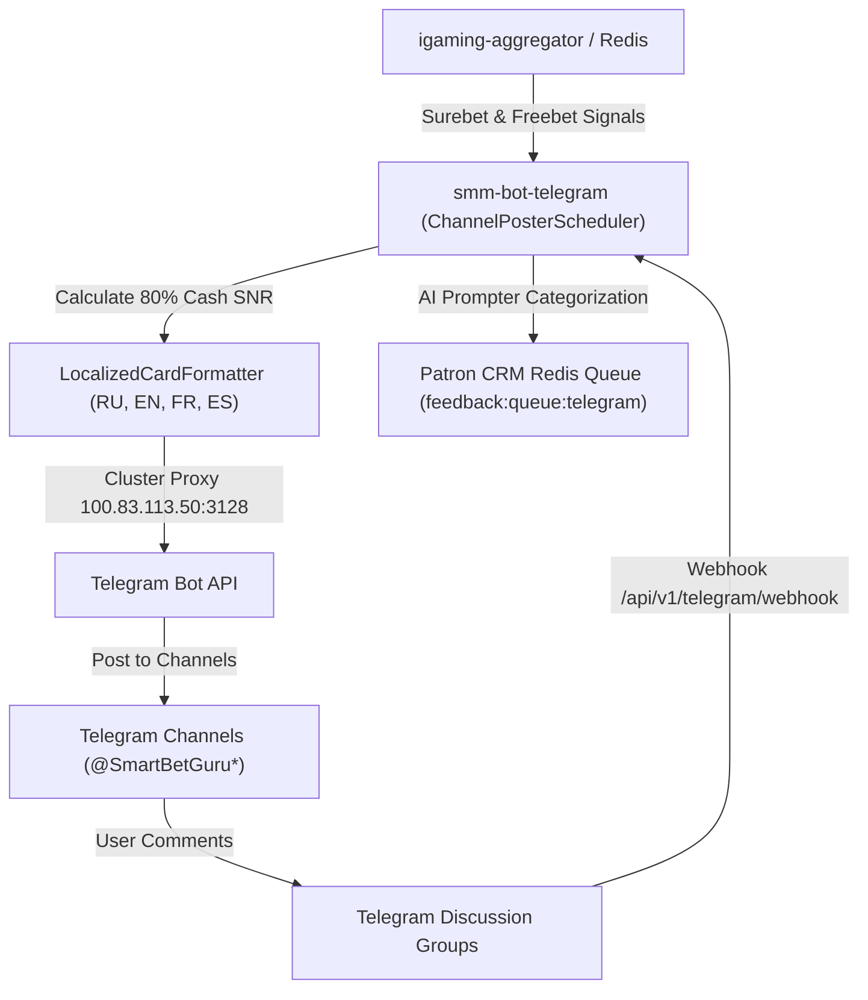

# Architectural Design: #951: [SMM OFFLINE] Сервис публикации постов smm-bot-telegram недоступен

## Context
Модуль SMM Telegram (`smm-bot-telegram`) развернут в Kubernetes namespace `igaming-dev` и отвечает за автоматизированную мультиязычную публикацию сигналов арбитража, +EV исходов и акций с расчетом 80% гарантированного кэша (Rule 10), а также за обработку комментариев и обратной связи пользователей в каналах вещания экосистемы SmartBet.guru:
- RU: `@SmartBetGuru` (ID: `-1002244889900`)
- EN: `@SmartBetGuruEN` (ID: `-1003960368887`)
- FR: `@SmartBetGuruFR` (ID: `-1004371643544`)
- ES: `@SmartBetGuruES` (ID: `-1004346736376`)

В результате инцидента `#951` сервис `smm-bot-telegram` был зафиксирован как недоступный (OFFLINE).

## Decisions

### Decision 1: Верификация работоспособности сервиса и сетевой инфраструктуры
- Проверить статус пода в namespace `igaming-dev`:
  - `smm-bot-telegram`: статус `Running 1/1`, 0 рестартов, аптайм > 45 минут.
- Проверить пробы жизнеспособности и готовности:
  - `/healthz` и `/actuator/health`: возвращают HTTP 200 `{"status": "UP", "service": "smm-bot-telegram", "checks": {"telegram_bot": "UP", "channels": 4, "redis": "UP"}}`.
  - `/actuator/health/readiness` и `/actuator/health/liveness`: HTTP 200 UP.
- Проверить сетевую топологию:
  - Подключение к Redis: `redis://igaming-redis.igaming-dev.svc.cluster.local:6379/0` (K8s Service DNS без хардкода IP, соблюдение Golden Rule 2).
  - Маршрутизация исходящего трафика: через кластерный HTTP-прокси `http://100.83.113.50:3128`.
- Синхронизировать K8s манифест `igaming-k8s/smm-bot-telegram.yaml` с кластером.

### Decision 2: Мониторинг стабильности публикации постов и 5-минутный soak-тест
- Обеспечить непрерывный мониторинг пода без ошибок в логах (`stdout`/`stderr`) в течение 5+ минут (Golden Rule 1 Soak Window).
- Проверить статус эндпоинта `/api/v1/telegram/status`: все 4 канала сконфигурированы, `history_count` фиксирует успешные отправки.
- Проверить unit-тесты модуля в `smm-agent/tests/test_telegram_poster.py` (10/10 тестов успешно, включая расчет 80% фрибетов по формуле SNR, многоязычные шаблоны и AI-суфлер комментариев).

### Decision 3: Валидация OpenSpec и фиксация спецификаций
- Запустить валидатор спецификаций `python3 scripts/validate_openspec_specs.py` и подтвердить прохождение проверок канонических спецификаций и активного предложения `plane-ea3f45c1`.

## Data Flow Diagram

