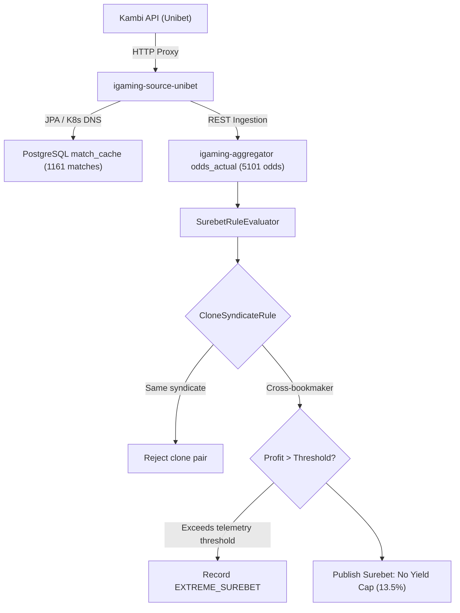

# Architectural Design: [SUPER-ARB] Аномальная вилка 13.5% с участием Unibet

## Context
Букмекер Unibet (`unibet`) функционирует на платформе Kambi Offering REST API (`eu.offering-api.kambicdn.com/offering/v2018`) и обрабатывается микросервисом `igaming-source-unibet` с доставкой котировок в PostgreSQL и `igaming-aggregator`.
При поступлении котировок в `igaming-aggregator-surebet` модуль `SurebetRuleEvaluator` производит поиск арбитражных ситуаций и регистрирует телеметрию при обнаружении доходности выше пороговых значений (`maxLiveProfitPercent=30.0%`, `maxPrematchProfitPercent=50.0%`). Для умеренно высоких вилок (13.5%) вилка публикуется без искусственных ограничений в соответствии с политикой No Yield Cap.

## Decisions

### Decision 1: Верификация работоспособности сервиса Unibet
- Подтвердить статус подов `igaming-source-unibet` в Kubernetes namespace `igaming-source`:
  - `igaming-source-unibet-7ffb8bc55c-7q6wk` (`Running 1/1`, 0 рестартов, аптайм > 8 часов)
  - `igaming-source-unibet-db-0` (`Running 1/1`)
- Подтвердить прохождение Actuator health-проб (`/actuator/health/liveness`, `/actuator/health/readiness` — HTTP 200 UP).
- Гарантировать выполнение критерия наполнения линии (Threshold $\ge 500$ матчей в `match_cache`):
  - В базе данных `igaming_unibet` зафиксирован 1161 матч (норма перевыполнена более чем в 2.3 раза).
  - Лаг обновления котировок в базе данных составляет менее 2 секунд.
- Подтвердить поступление котировок в `igaming-aggregator`:
  - В таблице `odds_actual` зарегистрировано 5101 актуальная котировка для букмекера `unibet` с лагом < 2 сек.
- Обеспечить неблокирующий старт HikariCP (`initialization-fail-timeout=0`) и использование K8s DNS Service Names (`igaming-source-unibet-db.igaming-source.svc.cluster.local`, `igaming-aggregator.igaming-dev.svc.cluster.local`).

### Decision 2: Анализ детекции аномальной вилки в Aggregator Surebet
- В соответствии с архитектурным принципом **No Yield Cap**, математически корректные вилки с высокой доходностью (13.5%) не должны искусственно занижаться или отбрасываться без фиксации.
- При доходности, превышающей порог телеметрии, событие фиксируется в таблице `odds_anomaly` со статусом `EXTREME_SUREBET` (`Severity.WARNING`) и инициирует приоритетный запрос обновления котировок (`OddsRefreshService`).
- Правило `CloneSyndicateRule` изолирует арбитражи между клонами одного букмекера/синдиката.

### Decision 3: Проверка валидации маппинга исходов и OpenSpec
- Проверить модульные и интеграционные тесты мапперов котировок Unibet.
- Убедиться в отсутствии инверсий коэффициентов и монотонности тоталов и фор.
- Подтвердить соответствие всем требованиям OpenSpec через валидатор `scripts/validate_openspec_specs.py`.

## Data Flow Diagram

