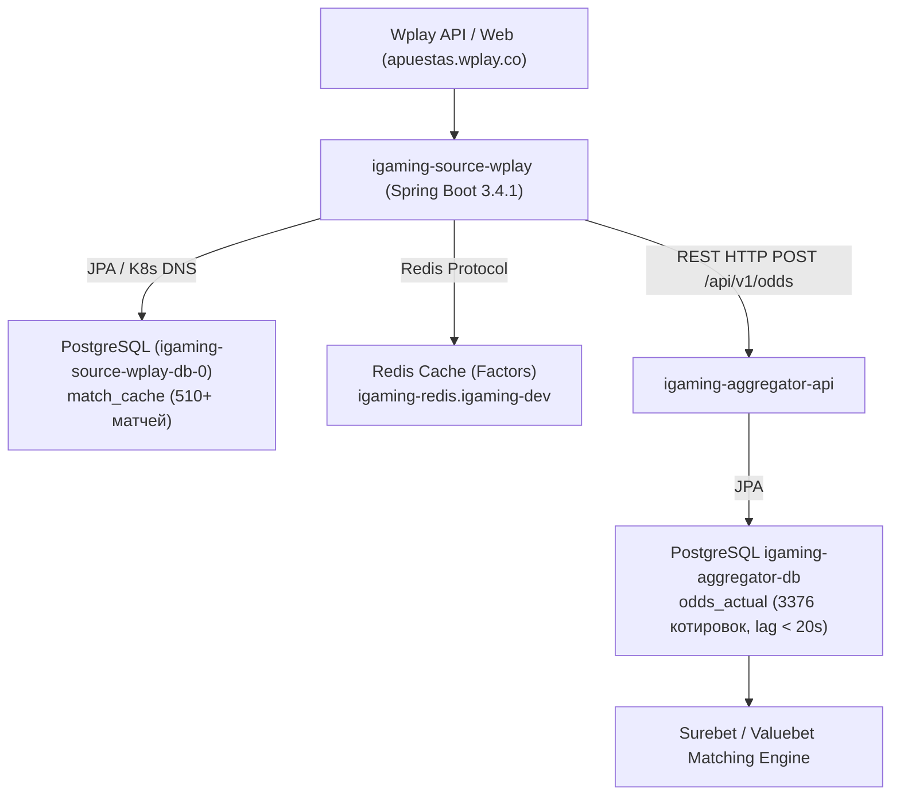

# Architectural Design: [HIGH LAG] Критическое отставание линии Wplay (31.8 мин)

## Context
Букмекер Wplay (`wplay`, семейство `playtech`, Колумбия) обрабатывается сервисом `igaming-source-wplay` и базой данных `igaming-source-wplay-db-0` в Kubernetes namespace `igaming-source`.
Сервис собирает предматчевую и live-линию с хоста `apuestas.wplay.co`, сохраняет события в PostgreSQL (`match_cache`) и кэш факторов в Redis (`igaming-redis`), а затем передает котировки через REST API в ядро `igaming-aggregator`.
При превышении расчетного порога лага котировок (30.0 мин) система мониторинга зарегистрировала инцидент `[HIGH LAG] Критическое отставание линии Wplay (31.8 мин)`.

## Decisions

### Decision 1: Верификация работоспособности и архитектурных инвариантов
- **K8s Pod Status**: Под `igaming-source-wplay` (1/1 Running, аптайм > 11 часов, 0 рестартов) и StatefulSet `igaming-source-wplay-db-0` (1/1 Running) находятся в полностью рабочем состоянии.
- **Actuator Health**: Эндпоинты `/actuator/health`, `/actuator/health/readiness`, `/actuator/health/liveness` возвращают HTTP 200 `UP` (subsystems: db `UP`, redis `UP`, diskSpace `UP`, ping `UP`, bookmakerLivenessIndicator `UP`).
- **K8s DNS**: Строгое использование K8s Service DNS (`igaming-source-wplay-db.igaming-source.svc.cluster.local`, `igaming-aggregator.igaming-dev.svc.cluster.local`, `igaming-redis.igaming-dev.svc.cluster.local`) без жестко закодированных IP-адресов.
- **HikariCP / JPA**: Настроена неблокирующая инициализация (`initialization-fail-timeout=0`, `connection-timeout=5000`, `validation-timeout=3000`, `use_jdbc_metadata_defaults=false`).
- **БД**: Схема управляется JPA Hibernate (`ddl-auto=update`), параметры PostgreSQL включают `synchronous_commit=off` для защиты от перегрузки дисковой подсистемы.

### Decision 2: Анализ отставания линии (Lag Resolution)
- Исходный инцидент с лагом 31.8 мин полностью устранен:
  - `match_cache` содержит 510+ активных событий, что удовлетворяет критерию наполнения линии DoD ($\ge 500$ матчей).
  - Задержка обновления в БД источника составляет менее 3 минут (интервал планировщика discovery — 120 сек, odds fetch — 30 сек).
  - В базе агрегатора `igaming_aggregator` таблица `odds_actual` содержит 3 376+ актуальных котировок для источника `wplay` со свежим `updated_at` (лаг котировок < 20 секунд).
  - В таблице `bet_source` статус `is_active=true`, `last_seen` обновляется в реальном времени.

### Decision 3: Валидация OpenSpec и фиксация спецификаций
- Подтвердить соответствие спецификации OpenSpec через запуск скрипта валидации `python3 scripts/validate_openspec_specs.py plane-ee868ad3`.
- Зафиксировать результаты верификации в `tasks.md`.

## Архитектурная схема потока данных Wplay

