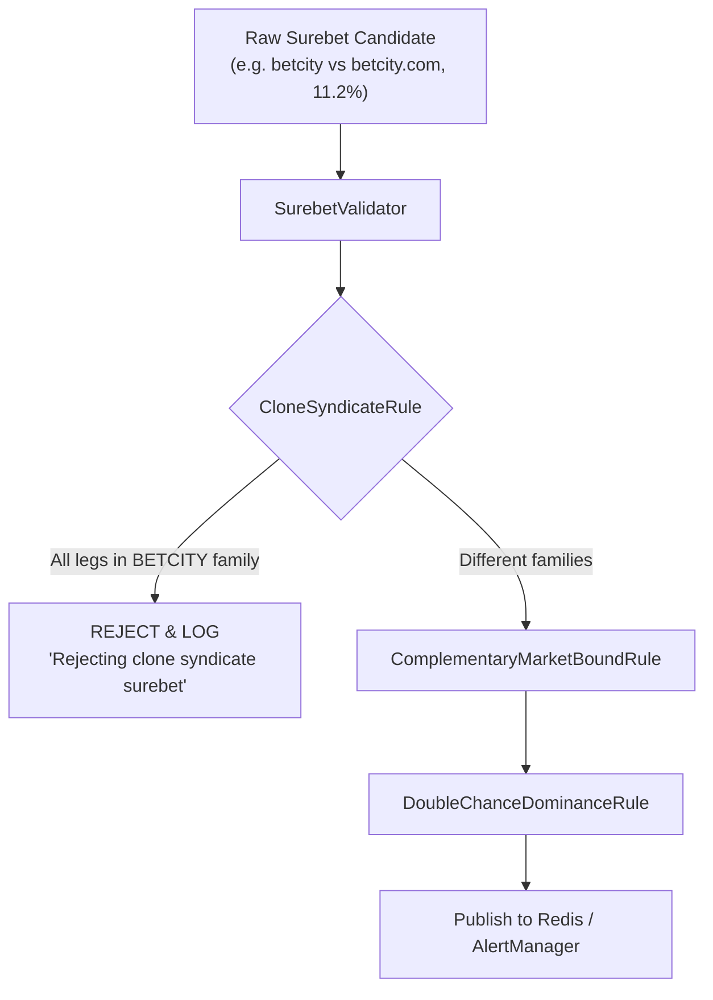

# Architectural Design: [SUPER-ARB] Аномальная вилка 11.2% с участием Betcity.com

## Context
В модуле вычисления арбитражных ситуаций `igaming-aggregator-surebet` реализован конвейер валидации вилок `SurebetValidator`.
Один из ключевых валидаторов — `CloneSyndicateRule`, отсекающий вилки, в которых все плечи принадлежат одной букмекерской семье (клонам/синдикату), поскольку котировки между ними не являются независимыми рынками, а различия возникают исключительно из-за рассинхронизации стриминга.

При анализе инцидента `[SUPER-ARB] Аномальная вилка 11.2% с участием Betcity.com` обнаружено, что источник `betcity.com` (а также `betcity.ru`, `betm`, `betcitynl`) не распознавался как часть единого синдиката `BETCITY`, что приводило к фиксации ложных вилок с высокой доходностью (до 14.89%) между доменами одного букмекера (например, `betcity` vs `betcity.com`).

## Decisions

### Decision 1: Расширение словаря семейств букмекеров и нормализация алиасов
В классе `CloneSyndicateRule`:
1. В статическую таблицу `BOOKMAKER_FAMILIES` добавлены все известные алиасы и вариации написания Betcity:
   - `betcity`, `betcity-ru`, `betcity.ru`, `betcity_ru`
   - `betcity-com`, `betcity.com`, `betcity_com`
   - `betcity-by`, `betcity.by`, `betcity_by`
   - `betcitynl`, `betcity-nl`, `betcity.nl`
   - `betm`, `бетсити`
2. В метод `resolveFamily(String bookmaker)` добавлен двухступенчатый защитный механизм:
   - Санитайзинг: замена точек и нижних подчеркиваний на дефис (`norm.replace('.', '-').replace('_', '-')`) и повторный поиск в словаре.
   - Префиксное сопоставление: `norm.startsWith("betcity") -> "BETCITY"`.

### Decision 2: Тестирование и деплой в Kubernetes
1. Покрытие unit-тестами в `SurebetRuleEvaluatorTest.java`:
   - `shouldRejectBetcityAndBetcityComCloneSyndicateSurebet`
   - `shouldRejectBetcityComAndBetmCloneSyndicateSurebet`
   - `shouldRejectBetcityRuAndBetcityNlCloneSyndicateSurebet`
2. Сборка и деплой образа `igaming-aggregator-surebet` в K8s namespace `igaming-dev`.
3. Мониторинг логов пода подтвердил успешное отклонение аномалий:
   - `Rejecting clone syndicate surebet on match 191989 (Ванкувер Джайантс vs Брендон Уит Кингс) in TOTAL:4.5: all legs belong to family BETCITY ... profit=11.00%`.
4. Под выдержал 5-минутный soak-тест со статусом `Running 1/1`, 0 рестартов, Actuator health `UP` (HTTP 200).

## Архитектурная схема валидации вилок

