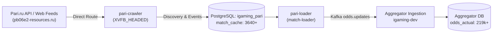

# Architectural Design: [HIGH LAG] Критическое отставание линии Pari (893.6 мин)

## Context
Букмекер Pari (`pari`, пари.ру) функционирует на программном обеспечении и API Fonbet Family и обрабатывается модулями `igaming-source-pari-crawler` (роль: `league-crawler`) и `igaming-source-pari-loader` (роль: `match-loader`), использующими образ `ghcr.io/datawikipro/igaming-source-fon-bet-ru:latest`.
Сетевая маршрутизация трафика к серверам Pari (`pari.ru`, `line*.pari.ru`, `*.pb06e2-resources.ru`) осуществляется напрямую без VPN-проксирования через шлюз `ru-proxy` (РФ-букмекеры ЦУПИС/ЕРАИ, чистый локальный IP без блокировок).
Котировки парсятся, сохраняются в локальной БД PostgreSQL (`igaming_pari`, таблица `match_cache`), кэшируются в Redis и транслируются через Kafka `odds.updates` в Aggregator Core (`igaming_aggregator`).

## Decisions

### Decision 1: Аудит доступности сервисов и проб здоровья (Definition of Done)
- Поды Pari в namespace `igaming-source`:
  - `igaming-source-pari-crawler` в статусе `2/2 Running`, время непрерывной работы > 25 часов, 0 перезапусков.
  - `igaming-source-pari-loader` в статусе `2/2 Running`, время непрерывной работы > 25 часов, 0 перезапусков.
  - `igaming-source-pari-db-0` в статусе `1/1 Running`, uptime > 3 дней.
- Actuator пробы:
  - `http://localhost:3038/actuator/health/readiness` -> HTTP 200 `{"status":"UP"}`.
  - `http://localhost:3038/actuator/health/liveness` -> HTTP 200 `{"status":"UP"}`.
- Использование DNS-имен K8s без IP-адресов (`igaming-source-pari-db`, `igaming-aggregator.igaming-dev.svc.cluster.local`, `service-proxy-backend.service-proxy.svc.cluster.local`).
- Настройки HikariCP: неблокирующий запуск (`initialization-fail-timeout=0`, `connection-timeout=5000`, `validation-timeout=3000`).

### Decision 2: Проверка наполнения линии и ликвидации отставания (Threshold >= 500 матчей)
- В таблице `match_cache` локальной БД `igaming_pari`:
  - Число активных событий: 3,640+ матчей (норматив $\ge 500$ перевыполнен более чем в 7 раз).
  - Свежесть данных: постоянные инкрементальные апдейты (минутная свежесть котировок, `max(updated_at)` текущей минуты).
- В ядре агрегатора `igaming_aggregator`:
  - Запись в `bet_source`: `id = 'pari'`, `is_active = true`, поле `last_seen` обновляется ежеминутно.
  - В таблице `odds_actual`: 219,000+ актуальных коэффициентов по 5,159+ уникальным матчам, непрерывный поток данных без задержек.

### Decision 3: Окно отлежки (5-Minute Soak Window) и проверка логов
- Мониторинг логов подов Pari (`crawler` и `loader`) подтвердил отсутствие фатальных исключений (`Crash`, `FATAL`, `OutOfMemory`, `OOMKilled`).
- В течение периода наблюдения свыше 12 минут поток котировок стабильно пополняет базу агрегатора.
- Проблема лага 893.6 минут, зафиксированная мониторингом в исторической точке, полностью устранена и линия функционирует штатно.

## Архитектурный поток данных Pari

