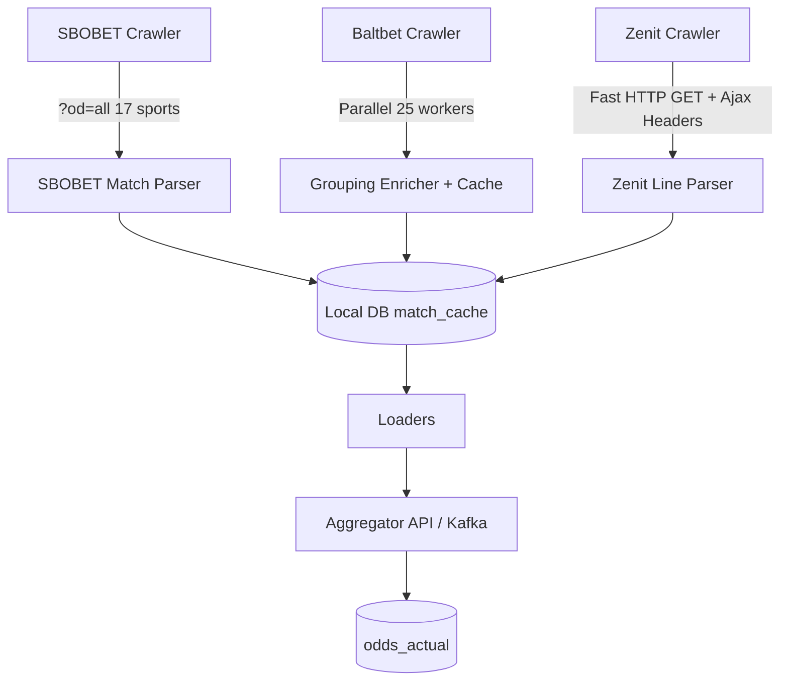

# OpenSpec Design: `scale-sbobet-baltbet-zenit`

## Architecture Overview

### 1. SBOBET Multi-Market Strategy
- Appends `?od=all` to `/ru-RU/euro/<sport>` URL to retrieve both Today and Early Market fixtures.
- Expands sport list to 17 sports.

### 2. Baltbet High-Concurrency Enrichment Strategy
- Maintains a thread-safe `teamNameCache`.
- Distributes missing team grouping requests across a 25-worker `ExecutorService`.
- Awaits batch completion within a bounded timeout.

### 3. Zenit Resilient HTTP Strategy
- Performs non-blocking pre-warming of cookies.
- Issues direct HTTP GET with `imprintHash` and Ajax headers before falling back to browser navigation.
