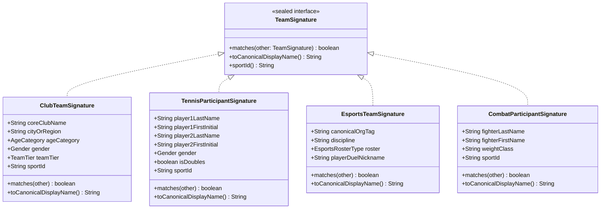

# Technical Design: Sport-Polymorphic Team Signatures

## 1. Domain Model Hierarchy (Java 21 Sealed Interfaces)

---

## 2. Enums
- `AgeCategory`: `MAIN`, `U16`, `U17`, `U18`, `U19`, `U20`, `U21`, `U23`, `YOUTH`.
- `Gender`: `MALE`, `FEMALE`, `MIXED`.
- `TeamTier`: `MAIN`, `RESERVE_2` (B/2), `RESERVE_3` (C/3), `YOUTH` (мол).
- `EsportsRosterType`: `MAIN`, `JUNIOR`, `ACADEMY`, `FEMALE`.

---

## 3. Strict Bookmaker Regular Expression Engines

### 3.1. ClubTeamSignatureParser
* **Age Regexes**:
  - Winline: `\s*\(до\s*(\d{2})\)` $\rightarrow$ `AgeCategory.Uxx`
  - Betcity: `\s*\((\d{2})\)$` $\rightarrow$ `AgeCategory.Uxx` (only at end of string)
  - Leon: `\s+U(\d{2})$` $\rightarrow$ `AgeCategory.Uxx`
  - Generic: `\s*U-?(\d{2})\b` $\rightarrow$ `AgeCategory.Uxx`
* **Gender Regexes**:
  - `\s*\((?:ж|жен|жен\.|w|women)\)` $\rightarrow$ `Gender.FEMALE`
* **Reserve Tiers**:
  - Betcity: `\s+B$` $\rightarrow$ `TeamTier.RESERVE_2`, `\s+C$` $\rightarrow$ `TeamTier.RESERVE_3`
  - Winline/Fonbet: `\s*\(мол(?:одежь|\.)?\)` $\rightarrow$ `TeamTier.YOUTH`
* **Prefix Stripper**:
  - `^(?:ФК|FC|БК|BC|ХК|HC|ПФК|PFC|МФК|MFC|ЖФК|WFC)\s+`
  - `\s+(?:ФК|FC|БК|BC|ХК|HC)$`

### 3.2. TennisSignatureParser
* **Singles Parsing**:
  - "LastName FirstName": extracts `LastName` and `FirstInitial`
  - "FirstName LastName": extracts `LastName` and `FirstInitial`
  - "LastName F.": extracts `LastName` and `F`
* **Doubles Parsing**:
  - Splits by `/`, ` / `, `&`, ` / & / `
  - Normalizes both players independently

### 3.3. EsportsSignatureParser
* **Player Duels Extraction**:
  - Matches `^[A-Z0-9_\\[\\]]+\\s*\\((?:TEAM\\s+)?([^)]+)\\)$`
  - Sets `playerDuelNickname` and `canonicalOrgTag`
