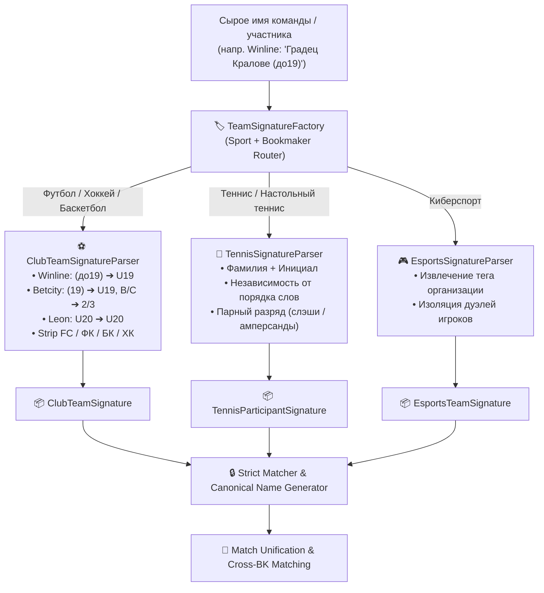

# OpenSpec Proposal: Sport-Polymorphic Team Signatures & Strict BK Regex Engine

## 🎯 Summary
Внедрение строгого полиморфного механизма идентификации и нормализации участников матчей (**Sport-Polymorphic Team Signatures**) с индивидуальными регулярными выражениями под каждого букмекера (Winline, Betcity, Leon, Fonbet, Zenit, 1x/BetB2B). Архитектура основана на `sealed interface TeamSignature` в Java 21 с разделением на `ClubTeamSignature` (командные виды), `TennisParticipantSignature` (одиночный и парный теннис), `EsportsTeamSignature` (киберспорт и дуэли) и `CombatParticipantSignature` (единоборства).

---

## 📌 Problem & Requirements
1. **Запрет нестрогих метрик расстояния**: Метрики строкового сходства (Levenshtein, Jaro-Winkler > 85%) приводят к фатальным ложным склейкам коротких названий (например, *ИРАК* ⚡ *ИРАН*, *Лида* ⚡ *Липа*, *Перу* ⚡ *Беру*).
2. **Разная природа видов спорта**:
   - **Футбол / Баскетбол / Хоккей**: определяются клубом, городом, возрастом (`U19`, `(до19)`, `(19)`), полом (`(ж)`), литерой резерва (`B`, `C`, `2`, `3`, `(мол)`).
   - **Теннис / Настольный теннис**: определяются фамилией, инициалом и напарником в парах (*Черной А.* == *Андрей Черной* == *Черной Андрей*).
   - **Киберспорт**: определяются тегом организации (*Team Spirit*, *PARIVISION*), ростером (*Junior*) и отделением 1х1 дуэлей игроков (*SATANIC vs WATSON*) от командного матча.
3. **Строгие BK-специфичные Regex**: Каждый букмекер форматирует возраст, пол и дубли по-своему (Winline: `(до19)`, `(ж) (унив)`; Betcity: `(19)`, `B`/`C`; Leon: `U20`, `U19`).

---

## 💡 Solution Architecture

