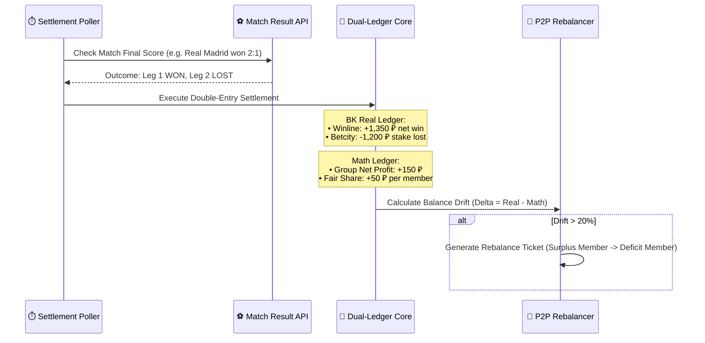

# Technical Design: Syndicate Autonomous Simulation & Dual-Ledger Settlement Engine

## 1. Virtual Accounts Hierarchy & Initial Balances

15 виртуальных аккаунтов распределяются по трем комнатам с реалистичными начальными балансами и пулом букмекеров:

### Группа 1: STANDARD Room (3 аккаунта)
| Участник | Роль | БК Счета | Стартовый баланс (RUB) |
|---|---|---|---|
| `std-master` (User #201) | MASTER (Казначей) | Winline (60,000 ₽), Fonbet (40,000 ₽) | 100,000 ₽ |
| `std-op-1` (User #202) | OPERATOR | Betcity (30,000 ₽), Pari (20,000 ₽) | 50,000 ₽ |
| `std-op-2` (User #203) | OPERATOR | LigaStavok (25,000 ₽), Leon (25,000 ₽) | 50,000 ₽ |
* **Общий банкролл Standard**: 200,000 ₽.

### Группа 2: PRO Room (5 аккаунтов)
| Участник | Роль | БК Счета | Стартовый баланс | Drop Burn All-In |
|---|---|---|---|---|
| `pro-master` (User #301) | MASTER | Winline (120,000 ₽), Fonbet (80,000 ₽) | 200,000 ₽ | ❌ |
| `pro-op-1` (User #302) | OPERATOR | Betcity (50,000 ₽), Pari (50,000 ₽) | 100,000 ₽ | ❌ |
| `pro-op-2` (User #303) | OPERATOR | Marathon BY (3,500 BYN $\approx$ 100,000 ₽) | 100,000 ₽ | ❌ |
| `pro-drop-1` (User #304) | DROP_OPERATOR | Fonbet (8,000 ₽) | 8,000 ₽ | ✅ `🔥 All-In Burn` |
| `pro-drop-2` (User #305) | DROP_OPERATOR | Betcity (12,000 ₽) | 12,000 ₽ | ✅ `🔥 All-In Burn` |
* **Общий банкролл PRO**: 420,000 ₽.

### Группа 3: ULTIMATE / UNLIM Room (7 аккаунтов)
| Участник | Роль | БК Счета | Стартовый баланс | Валюты |
|---|---|---|---|---|
| `ult-master` (User #401) | MASTER | Winline (250K ₽), Pinnacle (3,000 USDT) | 550,000 ₽ | RUB / USDT |
| `ult-op-1` .. `ult-op-6` (User #402–#407) | OPERATOR | Fonbet, Betcity, Pari, 1xBet, Marathon, Zenit | по 150,000 ₽ | RUB / BYN / USD |
* **Общий банкролл Ultimate**: 1,450,000 ₽.

---

## 2. Hourly Cron Betting Cycle & Multi-Factor Match Selector

Планировщик запускается по расписанию `0 * * * *` (каждый час):
1. **Multi-Factor Selection Algorithm**:
   Служба сканирует пул доступных арбитражных ситуаций и ранжирует их по комплексному скорингу:
   $$\text{Score}(A) = w_{yield} \cdot Y(A) - w_{time} \cdot \ln(1 + T_{start}) + w_{bal} \cdot B_{fit}$$
   - $Y(A)$: чистая доходность вилки ($4.0\% - 8.5\%$).
   - $T_{start}$: минут до начала матча (для LIVE событий $T_{start} = 0$, максимальный приоритет; для прематча — ближайшие 15–60 минут).
   - $B_{fit}$: соответствие требуемых плеч текущим реальным балансам счетов ($B_{real}$) в целевой комнате.
2. **Skew Optimization**: Рассчитывает размеры плеч через **Deep Smart-Skew**:
   - Плечо 1 (Фаворит, кэф 1.22–1.35): вероятность $75\%–82\%$, ставка $\approx 75\%$ от объема вилки.
   - Плечо 2 (Аутсайдер/Ничья, кэф 4.50–6.00): вероятность $18\%–25\%$, ставка $\approx 25\%$ от объема.
3. **Execution Record**: Создает запись виртуальной ставки `SyndicateVirtualBet` со статусом `PLACED`.

---

## 3. Visual Proof & Odds Highlight Engine

Для каждой ноги ставки генерируется карточка визуального доказательства:
```
+-------------------------------------------------------------+
|  WINLINE | Реал Мадрид — Барселона | 68' (1:1)               |
|  Исход: [ П1 (Победа Реал) ]                                 |
|  Коэффициент: [ >>> 1.25 <<< ]  <-- [NEON HIGHLIGHT BOX]     |
|  Сумма ставки: 5,400 ₽ | Потенциальная выплата: 6,750 ₽     |
+-------------------------------------------------------------+
```
- Визуальный элемент содержит четкий bounding box вокруг коэффициента, название БК, метку времени и хеш ставки.

---

## 4. Match Result Settlement & Dual-Ledger Accounting



### Формулы расчета проводок:
1. **Реальный баланс в БК (Real Ledger)**:
   $$B_{real}^{(win)} = B_{real}^{(win)} + (S_1 \times K_1) - S_1$$
   $$B_{real}^{(loss)} = B_{real}^{(loss)} - S_2$$
2. **Математический баланс (Math Ledger)**:
   $$P_{net} = (S_1 \times K_1) - (S_1 + S_2)$$
   $$M_{balance}^{(i)} = M_{balance}^{(i)} + \frac{P_{net}}{N} \quad (\forall i \in [1..N])$$
3. **Дрейф баланса (Balance Drift)**:
   $$\Delta_i = \frac{B_{real}^{(i)} - M_{balance}^{(i)}}{M_{balance}^{(i)}} \times 100\%$$
   Если $|\Delta_i| \ge 20\%$, генерируется `SyndicateRebalanceTicket` для клиринга.
