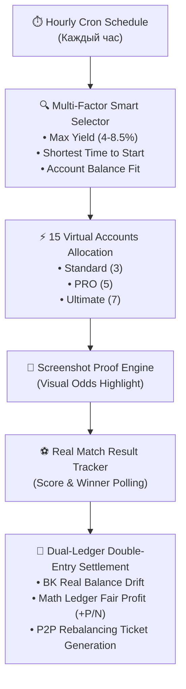

# OpenSpec Proposal: Syndicate Autonomous Simulation & Dual-Ledger Settlement Engine

## 🎯 Summary
Внедрение автономного фонового движка симуляции синдикатного арбитража для 15 виртуальных аккаунтов (3 Standard, 5 PRO, 7 Ultimate/Unlim), который **каждый час (раз в 60 минут)** совершает виртуальные ставки на реальные матчи из живого фида котировок, выбирая лучшие события по балансу доходности и минимальному времени до старта, сохраняет визуальные скриншоты с выделением коэффициентов, отслеживает фактические исходы матчей и совершает двойные бухгалтерские проводки (Dual-Ledger Settlement).

---

## 📌 Problem Statement & Motivation
Для демонстрации надежности, тестирования алгоритмов Deep Smart-Skew в долгосрочной перспективе и обучения пользователей механике синдиката необходима полностью автономная живая симуляция:
1. **15 изолированных виртуальных аккаунтов** разделены на 3 типа комнат:
   - **Standard (3 аккаунта)**: базовый моновалютный режим (RUB), до 6 БК на участника.
   - **PRO (5 аккаунтов)**: мультивалютный режим, дроп-счета `🔥 All-In Burn`, приоритетный сигнал Early-Bird.
   - **Ultimate / Unlim (7 аккаунтов)**: масштабируемый синдикат с автоматическим P2P-клирингом.
2. **Почасовой цикл и многофакторный подбор (Hourly Scoring)**: каждый час сервис выбирает наиболее привлекательную реальную вилку с учетом максимальной доходности ($4.0\%–8.5\%$) и минимального времени до старта матча (Live или старт в ближайшие 15–60 минут) для быстрого завершения раунда и проводок.
3. **Визуальные пруфы**: при каждой ставке фиксируется скриншот купона/линии с визуальным выделением (highlight / bounding box) коэффициента и исхода.
4. **Учет результатов матчей и проводки**: после завершения матча система определяет выигрышную и проигрышную ногу, производит расчет реальных балансов в БК ($B_{real}$) и справедливого математического баланса ($M_{balance}$), регистрируя P2P-тикеты ребалансировки при дрейфе балансов $> \pm 20\%$.

---

## 💡 Proposed Solution

---

## 🔒 Scope & Boundaries
- **In-Scope**:
  - Создание структуры 15 виртуальных аккаунтов с распределением по 3 комнатам.
  - 8-часовой планировщик (`SyndicateBettingScheduler`).
  - Генератор визуальных доказательств со скриншотом и выделением целевого коэффициента.
  - Модуль закрытия матчей (`MatchResultSettlementService`) с получением финального счета.
  - Двойная бухгалтерская проводка (Real Ledger vs Math Ledger).
  - Отображение истории симуляций, скриншотов и проводок в UI комнат.
- **Out-of-Scope**:
  - Реальный вывод фиатных средств со счетов виртуальных ботов (все проводки осуществляются в виртуальном контуре тестовой среды).
