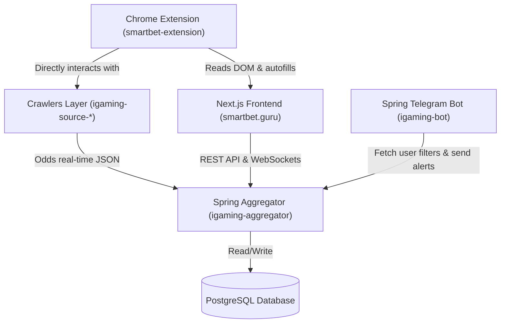

# Технологическая карта развития платформы SmartBet.guru

На основе глубокого анализа предоставленного бизнес-плана ([план.txt](file:///c:/Users/chernousov_a/Documents/igaming/%D0%BF%D0%BB%D0%B0%D0%BD.txt)) и детального аудита текущей архитектуры проектов (бэкенд `igaming-aggregator`, Telegram-бот `igaming-bot` и фронтенд `smartbet.guru`), разработан настоящий документ **план.md**. 

Данный документ сопоставляет стратегические цели бизнеса с существующим кодом, оценивает их реализуемость и формирует пошаговую техническую дорожную карту.

---

## 1. Сравнительный анализ: Требования vs Текущее состояние

Ниже приведена детальная таблица соответствия между целями из `план.txt` и тем, что **уже реализовано** в вашей кодовой базе, а также технические пробелы, которые предстоит устранить.

| Бизнес-требование из план.txt | Текущий статус в коде | Что необходимо доработать / реализовать с технической точки зрения |
| :--- | :--- | :--- |
| **Интервал обновления (Live) < 3.0 сек** | 🟢 **Частично реализовано**. Есть стабильная сеть краулеров (`igaming-source-*`), работающая с API букмекеров. | Оптимизировать парсеры, минимизировать накладные расходы при маппинге данных в `igaming-aggregator-ingestion`, настроить WebSocket-соединения с букмекерами там, где сейчас используется HTTP-поллинг. |
| **Количество БК: 150+ (СНГ, Азия, Африка)** | 🟡 **В процессе**. Реализованы ключевые БК (Fonbet RU/BY/KZ, Winline, Betcity, Marathonbet, Pinnacle, Leon, Zenit, Melbet, Olimpbet, Baltbet и др.). | Разработать новые модули краулеров под азиатские платформы (через BetB2B/1xBet API) и африканские конторы (Surebet247, Bet9ja). |
| **Модуль ставок с перевесом (+EV)** | 🔴 **Не реализован**. Бэкенд ищет только классический арбитраж (Surebets). | 1. **Бэкенд**: Написать `ValueBetFinderService` в `aggregator-surebet`. Алгоритм должен брать чистые коэффициенты Pinnacle, очищать их от маржи ($P_{win}$) и искать валуи у рекреационных букмекеров ($L \times P_{win} > 1.0$). 2. **Фронтенд**: Создать страницу `/valuebets`. |
| **Калькулятор критерия Келли** | 🟡 **Частично реализовано**. В `SurebetCalculator.tsx` есть формулы для 2-way и 3-way арбитража с округлением. | Добавить в `SurebetCalculator.tsx` режим "+EV / Келли", рассчитывающий размер ставки по формуле: $f^* = \frac{p(b+1) - 1}{b}$. |
| **Поиск Коридоров (Middles)** | 🔴 **Не реализован**. | Разработать `MiddleFinderService` на бэкенде. Он должен сопоставлять форы (Handicaps) и тоталы (Totals) двух букмекеров для нахождения зон перекрытия исходов. |
| **Функция "Близкие коэффициенты" (Close Odds)** | 🔴 **Не реализована**. | Расширить API `aggregator-api` так, чтобы при запросе конкретной вилки бэкенд возвращал список "дублирующих котировок" на те же исходы в других БК. Отображать их во фронтенде в карточке вилки. |
| **Встроенный браузер и автопростановка купонов** | 🔴 **Не реализован**. | Разработать Chrome Extension `smartbet-extension`, которое общается с сайтом через `chrome.runtime`, открывает вкладки БК во фреймах или соседних окнах, подменяет фингерпринт и автозаполняет сумму ставки. |
| **Маскировка цифрового отпечатка & Прокси** | 🟡 **Частично реализовано**. В репозитории есть скрипты управления VPN-пулом (`vpn-pool-healthcheck.sh`). | Интегрировать поддержку индивидуальных HTTP-прокси для каждой вкладки в разрабатываемом Chrome-расширении. |
| **Модуль учета («Бухгалтерия»)** | 🟡 **Частично реализовано**. Во фронтенде написан мощный `VirtualWalletDashboard.tsx`. | Связать кошельки с реальной историей ставок. Добавить кнопку "Лог ставки" на карточке вилки во фронтенде, которая списывает баланс с кошелька конкретной БК и добавляет ставку в трекер. |
| **Экспорт данных через XML/JSON API** | 🔴 **Не реализован**. | Реализовать контроллер `/api/v1/feed` на бэкенде с авторизацией по API-ключам для продажи сырых данных разработчикам ботов. |
| **Заморозка подписки** | 🔴 **Не реализована**. | Добавить поле `frozen_until` в сущность пользователя в базе данных и методы приостановки списания дней подписки в `igaming-auth-microservice`. |
| **SEO и бесплатный сканер (вилки < 1% с задержкой)** | 🟡 **Частично реализовано**. Бот имеет жесткие лимиты на отправку публичных вилок (до 6%). | На бэкенде и фронтенде реализовать middleware/фильтрацию: для неавторизованных пользователей отдавать вилки до 1.0% с 5-минутной задержкой. |
| **Каталог-справочник букмекерских контор** | 🔴 **Не реализован**. | Создать динамическую структуру страниц в Next.js `/bookmakers` с обзорами, бонусами и реферальными ссылками на БК для SEO-привлечения трафика. |
| **Интеграция с Telegram-ботом (сигналы по фильтрам)** | 🟢 **Почти готово**. Бот умеет работать с сессиями пользователей (`UserSessionService`) и слать уведомления. | Реализовать вебхуки или Kafka-топики: когда пользователь настраивает фильтры на SmartBet.guru, бэкенд шлет точечные алерты в бот с deep-link ссылкой на предзаполненный купон на сайте. |
| **Двухуровневая реферальная система (Revenue Share)** | 🔴 **Не реализована**. | Создать таблицы `referrals` и `transactions_referral` в БД. Разработать страницу `/referral` в кабинете пользователя Next.js с баннерами и iframe-виджетами. |

---

## 2. Архитектура интеграции новых модулей

Для реализации запланированных фич без нарушения работоспособности существующего продакшена, интеграция будет выполнена по модульному принципу:

### 2.1 Модуль ставок с перевесом (+EV) и Келли
1. **Расчет математического ожидания (+EV)**:
   * За "эталонную вероятность" берутся котировки Pinnacle (или Betfair) как низкомаржинального букмекера.
   * Коэффициенты эталона ($K_1, K_2$) очищаются от маржи по формуле:
     $$P_{clean\_1} = \frac{1/K_1}{1/K_1 + 1/K_2}$$
   * Если у рекреационного букмекера (например, Fonbet) коэффициент на этот же исход равен $L$, и выполняется условие:
     $$EV = P_{clean\_1} \times L - 1 > 0$$
     то ставка признается переоцененной (+EV).
2. **Внедрение в базу данных (`igaming-aggregator`)**:
   Добавление таблицы `value_bets` для хранения найденных перевесов в режиме реального времени.

### 2.2 Модуль Коридоров (Middles)
* В `aggregator-surebet` будет запущен параллельный планировщик, сопоставляющий форы и тоталы. Например:
  * Ставка 1: Тотал Больше 2.5 (коэф. 2.05) в БК Winline.
  * Ставка 2: Тотал Меньше 3.5 (коэф. 1.95) в БК Fonbet.
  * Интервал $[2.5 - 3.5]$ — это "коридор". Если в матче забивают ровно 3 гола, выигрывают обе ставки, обеспечивая сверхприбыль. При любом другом исходе потери минимальны.

### 2.3 Chrome-расширение для автопростановки и безопасности
* **Анонимизация**: Расширение перехватывает запросы к БК и через `chrome.declarativeNetRequest` или прокси-API привязывает купленный пользователем резидентный прокси к домену конкретной БК.
* **Автопростановка**: Расширение парсит DOM-дерево букмекерской конторы, находит поисковую строку, вводит название команд, переходит в событие, выбирает нужный исход и вставляет в купон сумму ставки, рассчитанную калькулятором SmartBet.guru. Это сокращает время простановки с 15 секунд до 1.5 секунд, сводя к минимуму риск изменения коэффициентов.

### 2.4 Интеграция "Сайт ↔ Telegram-бот"
* В профиле на сайте SmartBet.guru пользователь генерирует токен привязки.
* Перейдя в бот с параметром `/start?tg_auth=TOKEN`, бот связывает `telegram_chat_id` с аккаунтом на портале.
* Пользователь создает фильтр на сайте (например: *"Футбол, Live, Surebets > 3%, БК Fonbet + Winline"*).
* Бэкенд при нахождении подходящей вилки моментально генерирует событие в Kafka/RabbitMQ. Бот вычитывает событие и присылает сообщение с кнопкой **"Поставить на SmartBet.guru"**, ведущей на страницу матча с уже заполненными суммами.

---

## 3. Поэтапная дорожная карта реализации (Roadmap)

Совмещая бизнес-этапы из `план.txt` с нашими техническими возможностями, мы предлагаем следующую дорожную карту разработки:

### 🚀 Этап 1: Оптимизация ядра, SEO и Задержание трафика (Месяцы 1–3)
* **Цель**: Максимизировать органический трафик и улучшить поведенческие факторы сайта.
* **Технические задачи**:
  1. **Лимиты для гостей (SEO-магнит)**: 
     * Написать фильтрационный слой на бэкенде: если запрос к API анонимный, отдавать Surebets с прибылью $\le 1.0\%$ и искусственной задержкой в 300 секунд (5 минут).
     * Разместить на главной странице SmartBet.guru красивый виджет с этими бесплатными "медленными" вилками.
  2. **Каталог букмекеров (SEO)**:
     * Разработать динамический роутинг `/bookmakers` и `/bookmakers/[slug]` на Next.js.
     * Заполнить экспертными статьями и обзорами с реферальными ссылками на легальные и офшорные/крипто БК.
  3. **Интеграция Критерия Келли**:
     * Обновить React-компонент [SurebetCalculator.tsx](file:///c:/Users/chernousov_a/WebstormProjects/igaming/smartbet.guru/src/components/SurebetCalculator.tsx). Добавить вкладку "Келли и EV".
     * Написать формулу расчета оптимального фракционного размера ставки от банка.
  4. **Сокращение задержки Live-линий**:
     * Провести профилирование модулей `igaming-source-*` и перевести парсер Fonbet/Winline на прямое чтение API/Websockets, снижая лаг обновления до < 2.5 сек.

### ⚙️ Этап 2: Функциональное превосходство и Удержание аудитории (Месяцы 4–6)
* **Цель**: Превратить платформу в профессиональный инструмент и автоматизировать рутину.
* **Технические задачи**:
  1. **Реализация бэкенда ставок с перевесом (+EV)**:
     * Создать новый модуль `aggregator-valuebet` или расширить `aggregator-surebet` для вычисления математического ожидания относительно Pinnacle.
     * Реализовать сохранение валуев в БД и отдачу через API.
  2. **Реализация бэкенда Коридоров**:
     * Разработать алгоритм матчинга фор и тоталов для поиска коридоров.
  3. **Фронтенд для ValueBets и Middles**:
     * Создать страницы `/valuebets` и `/middles` в Next.js.
     * Подключить WebSocket-трансляцию для моментального обновления списков без перезагрузки страниц.
  4. **Модуль учета («Бухгалтерия»)**:
     * Связать существующий `VirtualWalletDashboard.tsx` с вилками. Добавить кнопку быстрого логгирования ставки в один клик.
  5. **Разработка Chrome Extension (Базовая версия)**:
     * Создать расширение для Chrome, умеющее парсить страницы smartbet.guru, перенаправлять пользователя на вкладки букмекеров и автоматически заполнять купоны для Fonbet, Winline и Betcity.

### 📈 Этап 3: Масштабная экспансия и Партнерская сеть (Месяцы 7–12)
* **Цель**: Масштабирование продаж подписок через сторонний трафик, вебмастеров и разработчиков ботов.
* **Технические задачи**:
  1. **Двухуровневая реферальная программа**:
     * Разработать базу данных для реферальных связей (кто кого пригласил, уровень 1 и уровень 2).
     * Добавить в профиль пользователя Next.js раздел `/referral` с детальной аналитикой переходов, регистраций, покупок и начисления баланса (20% -> 30% Gross Revenue Share).
     * Разработать iframe-виджеты с бесплатными вилками, которые партнеры могут вставлять на свои сайты.
  2. **Открытый API для разработчиков ботов**:
     * Реализовать модуль авторизации по токенам (`X-API-Key`) на бэкенде.
     * Задокументировать Swagger/OpenAPI эндпоинты `/api/v1/surebets` и `/api/v1/valuebets` для отдачи JSON/XML-потоков.
  3. **Функция "Заморозки подписки"**:
     * Интегрировать логику заморозки в биллинг-систему: при клике на "Заморозить" в кабинете, подписка приостанавливается, а дни действия сдвигаются. Ограничить использование (например, максимум 3 раза в год суммарно на 30 дней).
  4. **Разработка Chrome Extension (PRO-версия)**:
     * Добавить в расширение интеграцию с резидентными прокси и базовую эмуляцию Canvas/User-Agent для защиты от систем антифрода БК.

---

## 4. Оценка сложности и приоритеты реализации

| Фича / Модуль | Приоритет | Сложность разработки | Необходимые технологии / Компоненты |
| :--- | :---: | :---: | :--- |
| **Калькулятор Келли и EV в UI** | 🟢 Высокий | Low | TypeScript, React (`SurebetCalculator.tsx`) |
| **Лимиты для гостей & Задержка вилок (SEO)** | 🟢 Высокий | Low | Java (Spring Security/Filter), Next.js Middleware |
| **Каталог букмекеров (SEO)** | 🟢 Высокий | Medium | Next.js (App Router, ISR/SSR страницы), PostgreSQL |
| **Модуль ставок с перевесом (+EV) в бэкенде** | 🟢 Высокий | High | Java (Spring Boot, математический алгоритм на основе котировок Pinnacle) |
| **Интеграция фильтров Сайта с Telegram-ботом** | 🟡 Средний | Medium | Java, Spring Kafka/Events, Telegram Bot API |
| **Модуль Коридоров** | 🟡 Средний | High | Java (алгоритмы сопоставления тоталов/фор в реальном времени) |
| **Интеграция Бухгалтерии с купонами** | 🟡 Средний | Medium | React, Node.js/Java API, PostgreSQL |
| **Базовый Chrome Extension (Автокупон)** | 🟡 Средний | High | JavaScript (Chrome Extension Manifest V3, Content Scripts, DOM-манипуляции) |
| **Реферальная программа (2 уровня)** | 🔴 Низкий | Medium | Java (биллинг-логика), Next.js (ЛК партнера) |
| **Публичный XML/JSON API** | 🔴 Низкий | Medium | Java (Spring Web, Rate Limiting, API Key Auth) |
| **Заморозка подписки** | 🔴 Низкий | Low | Java, PostgreSQL (обновление схемы аккаунтов) |
| **PRO Chrome Extension (Прокси & Анонимизация)** | 🔴 Низкий | Very High | WebExtension API, Fingerprinting evasion, WebRTC blocking |

---

## 5. Заключение и дальнейшие шаги

Представленный план полностью реализуем силами текущего стека технологий проекта (Java Spring Boot + Next.js + PostgreSQL). Он позволяет двигаться итеративно, снижая риски и окупая разработку за счет постепенного внедрения SEO-инструментов и реферальной программы.

### Рекомендуемые действия прямо сейчас:
1. **Утвердить дорожную карту** и разбить ее на тикеты.
2. Начать с **Этапа 1** (настройка бесплатного сканера до 1% с задержкой для SEO-продвижения, обновление калькулятора с формулой Келли и оптимизация скорости Live-линий).
3. Перейти к разработке математического ядра для поиска **валуйных ставок (+EV)**, так как этот модуль имеет наивысшую ценность для опытных игроков и выделит smartbet.guru среди конкурентов нижнего ценового сегмента.
